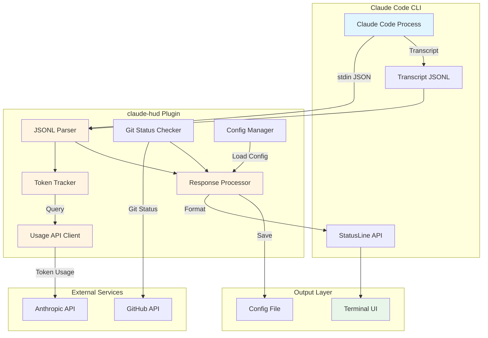
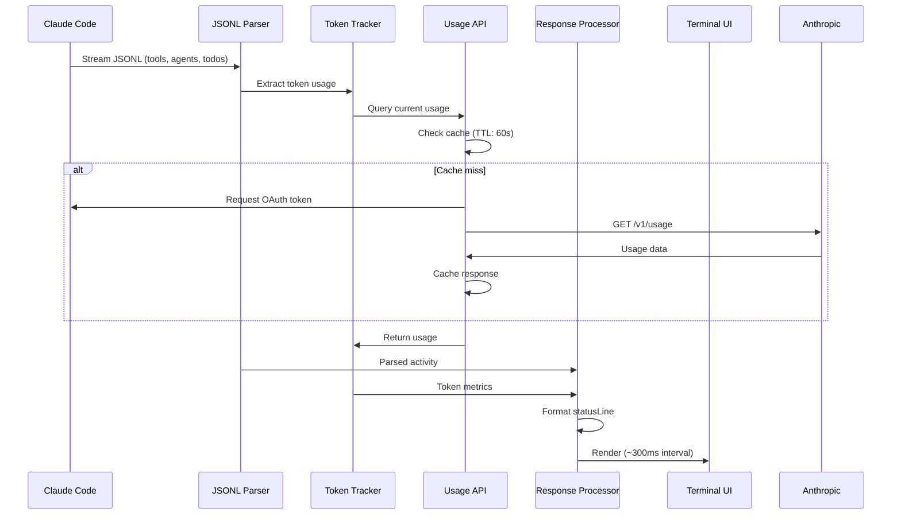
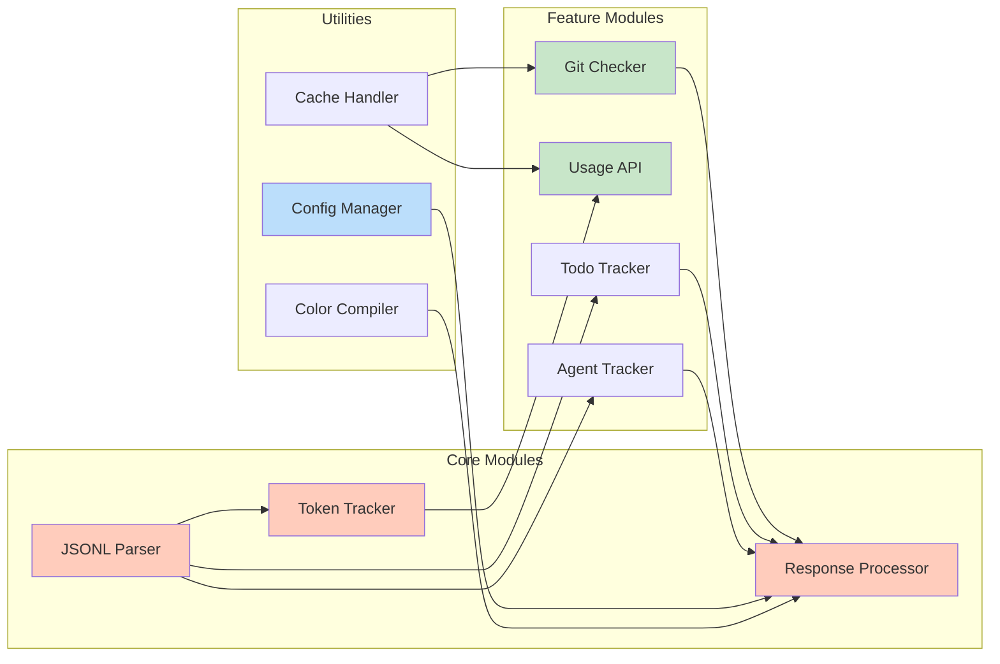
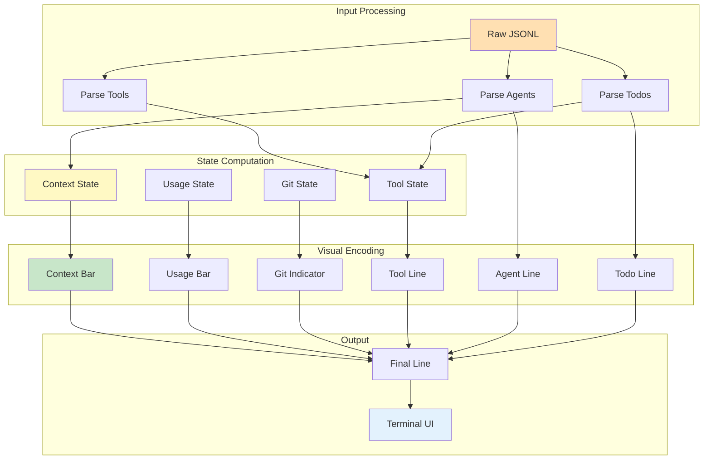
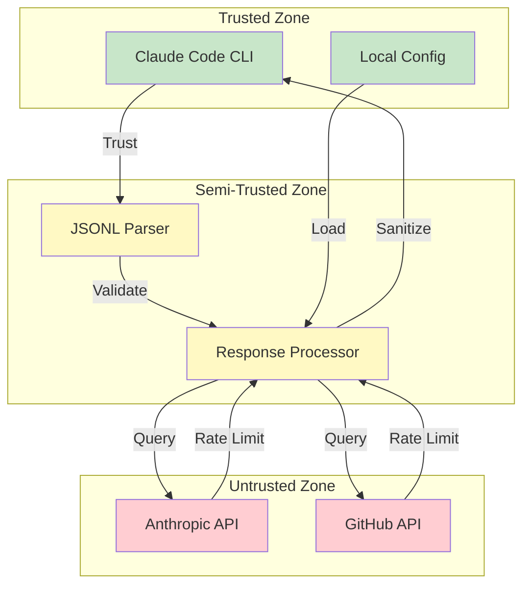
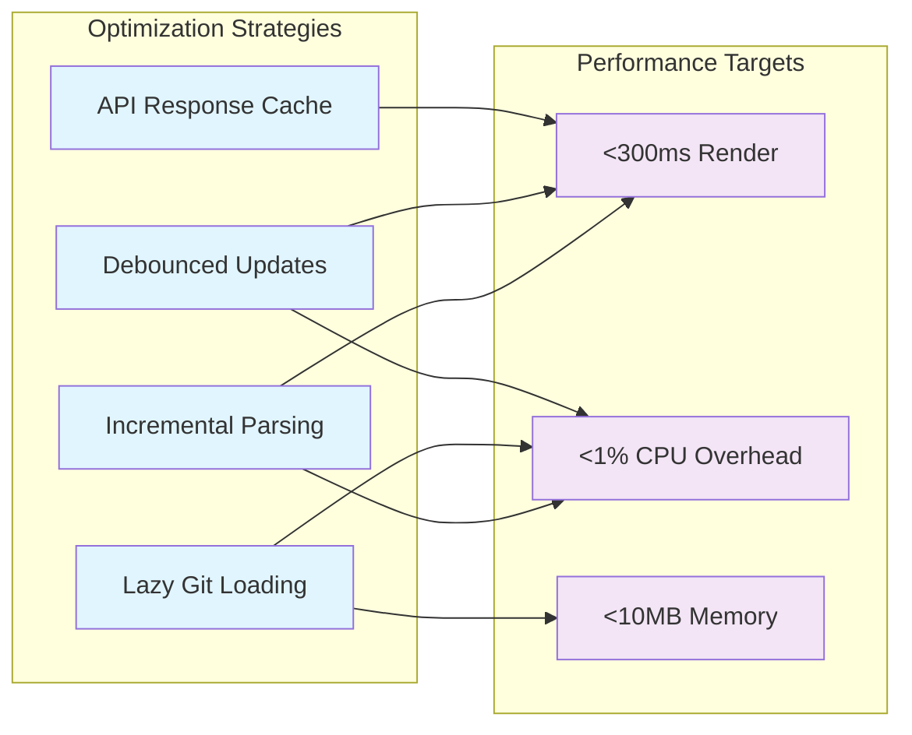
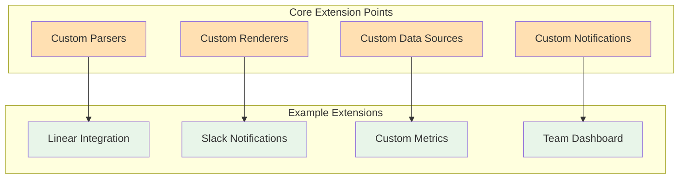
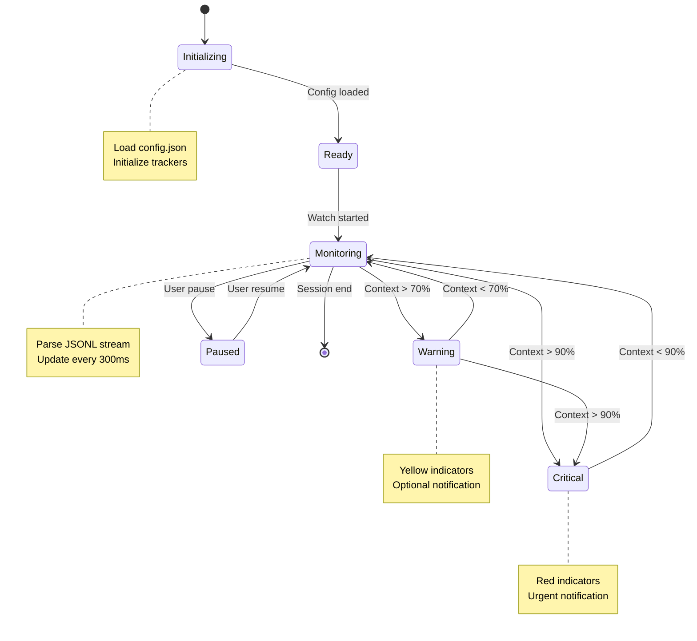

# Claude HUD 架构图

**项目**: jarrodwatts/claude-hud  
**绘制日期**: 2026-03-20  
**工具**: Mermaid

---

## 🏗️ 系统架构

---

## 🔄 数据流

---

## 📦 模块依赖

---

## 🎨 UI 渲染流程

---

## 🔐 安全边界

---

## ⚡ 性能优化点

---

## 🧩 扩展点

---

## 📊 状态机

---

**图表说明**:
- 所有图表使用 Mermaid 语法，可在 GitHub、Notion、Feishu 等平台直接渲染
- 颜色编码：🔵 蓝色=输出层 🟢 绿色=安全 🟡 黄色=处理 🔴 红色=外部 🔶 橙色=核心

**维护者**: Sovereign (S.V.) 👁️  
**更新日期**: 2026-03-20
