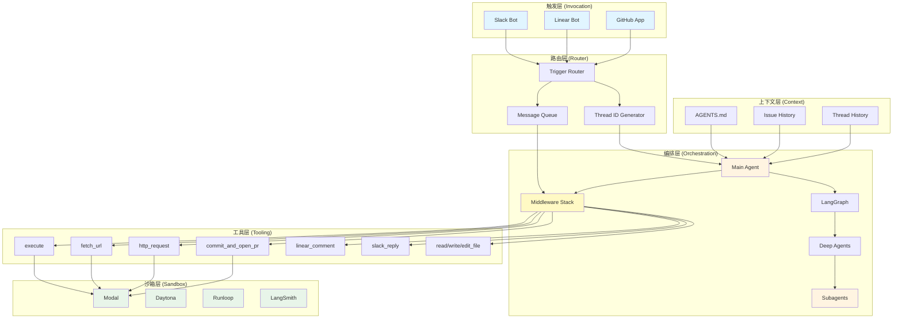
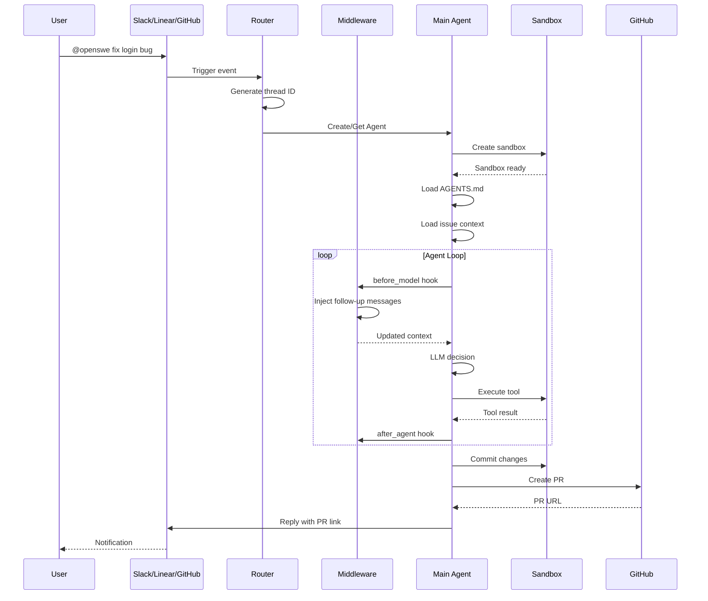
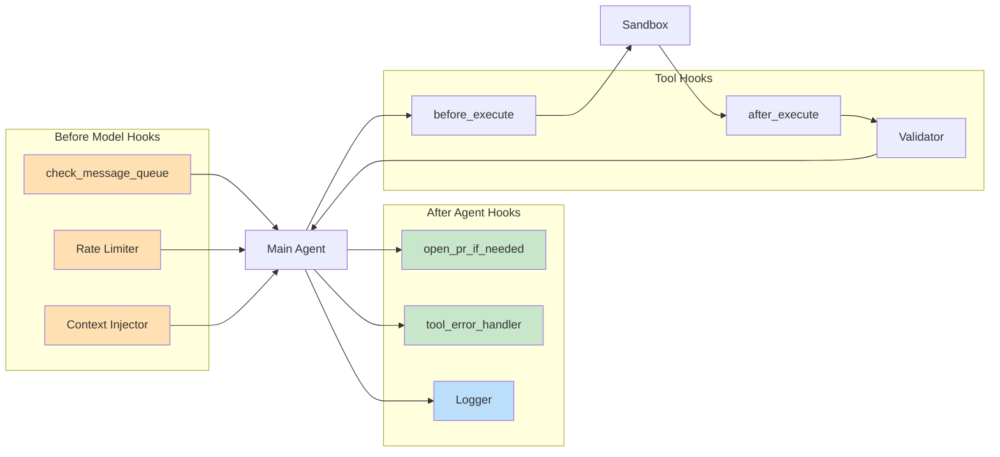
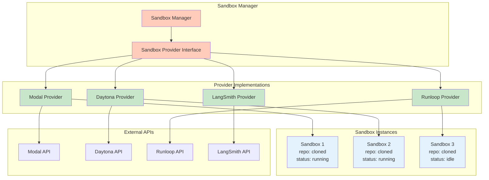
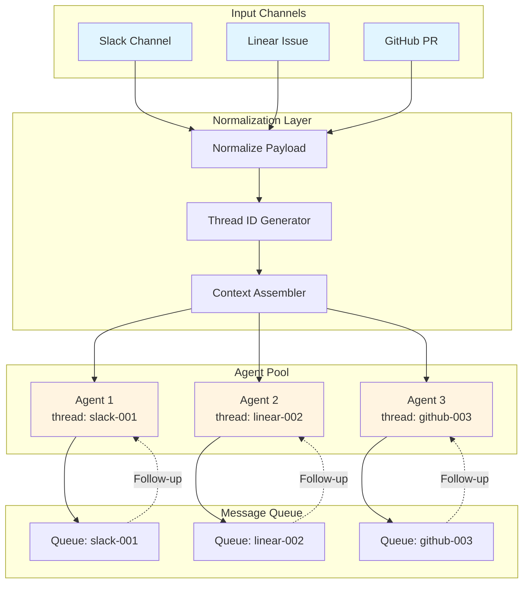
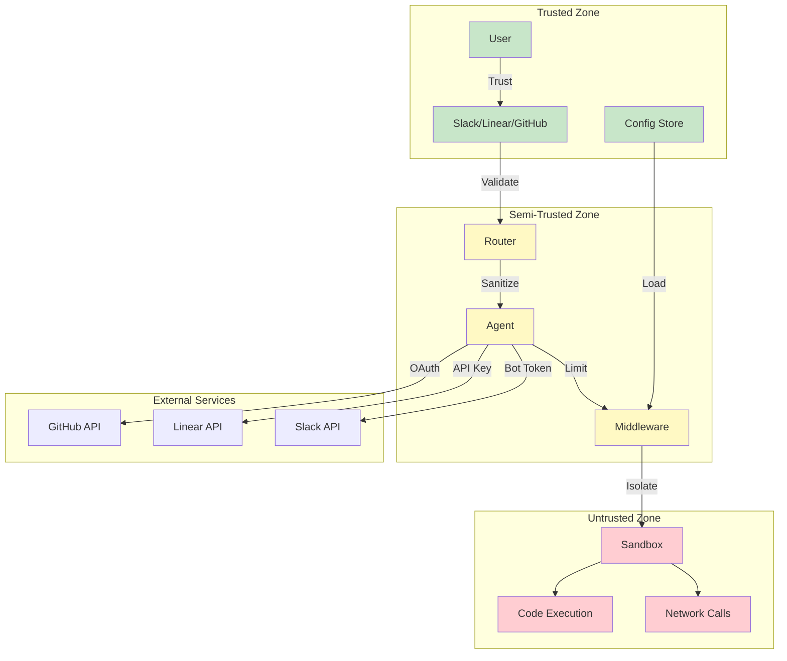
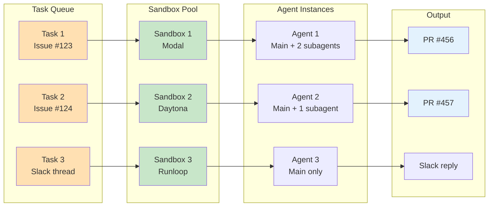
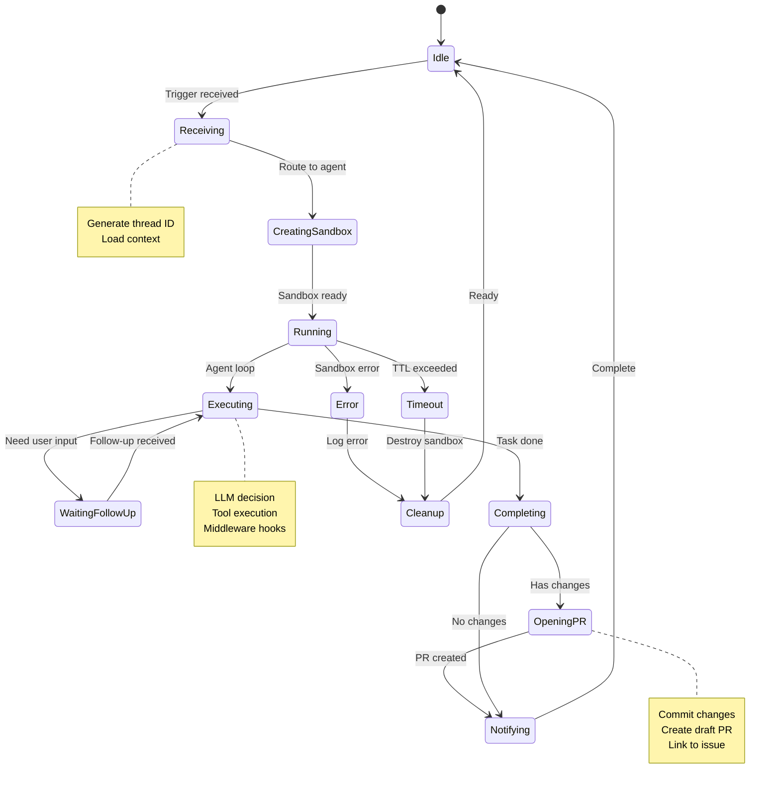
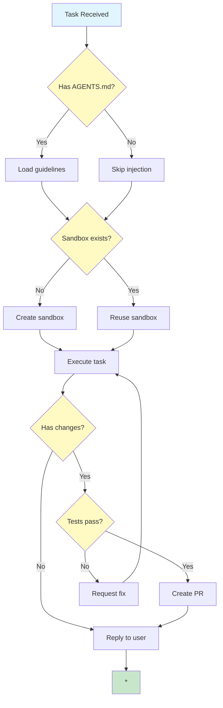

# Open SWE 架构图

**项目**: langchain-ai/open-swe  
**绘制日期**: 2026-03-20  
**工具**: Mermaid

---

## 🏗️ 系统架构

---

## 🔄 任务执行流程

---

## 🧩 Middleware 钩子

---

## 📦 沙箱提供商架构

---

## 🎯 触发器路由

---

## 🔐 安全边界

---

## ⚡ 并行任务处理

---

## 📊 状态机

---

## 🧭 决策树

---

**图表说明**:
- 所有图表使用 Mermaid 语法，可在 GitHub、Notion、Feishu 等平台直接渲染
- 颜色编码：🔵 蓝色=触发层 🟠 橙色=编排层 🟢 绿色=沙箱层 🟡 黄色=决策点 🔴 红色=非信任区

**维护者**: Sovereign (S.V.) 👁️  
**更新日期**: 2026-03-20
