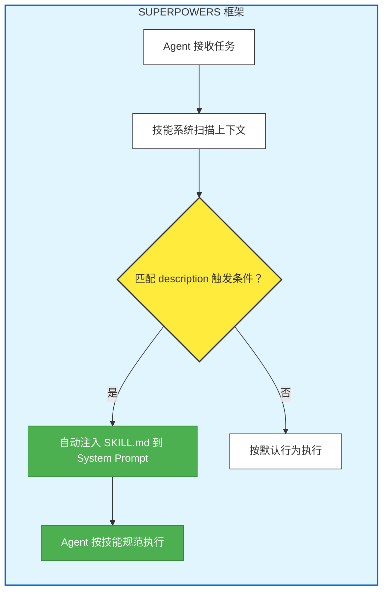
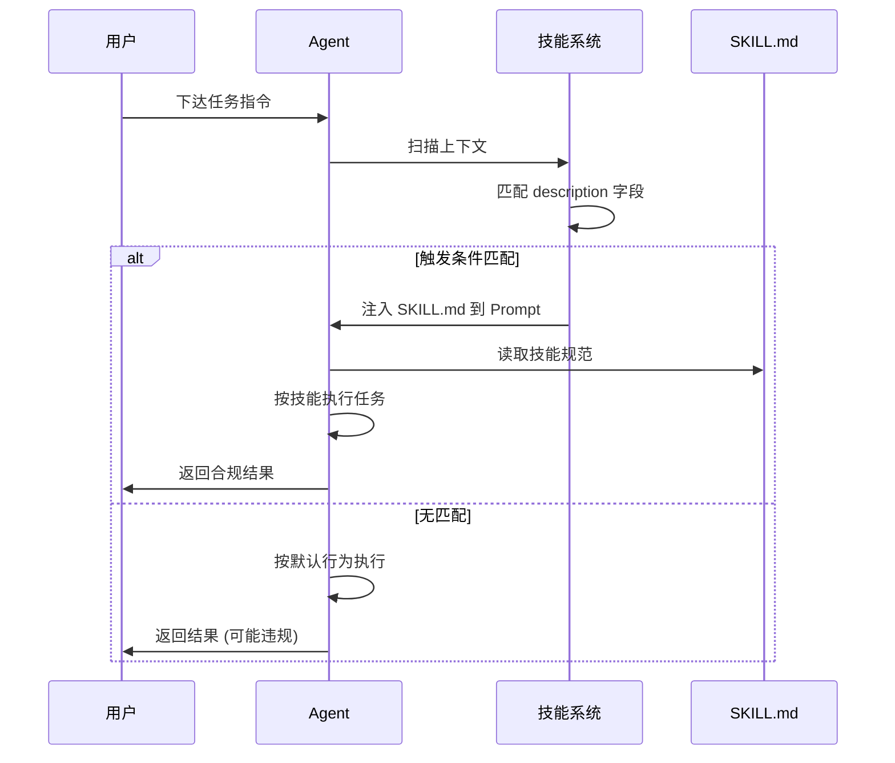
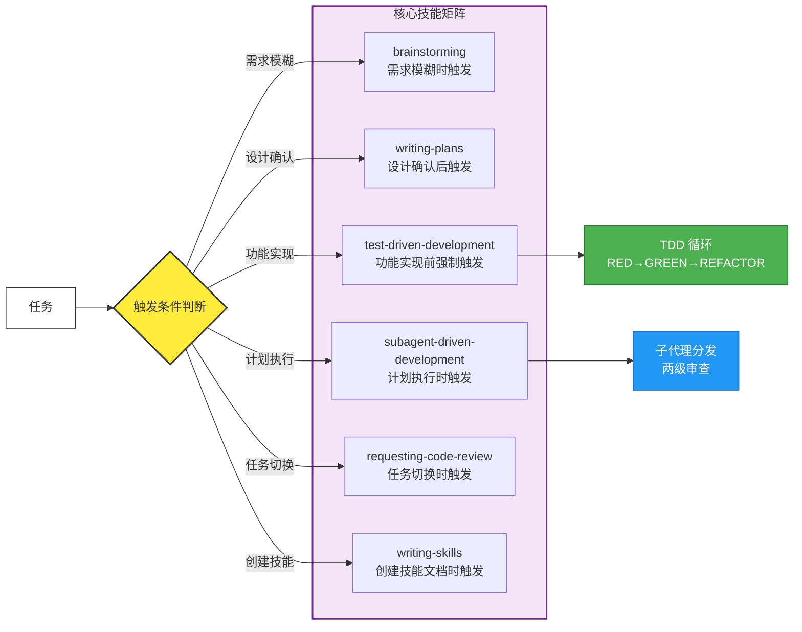
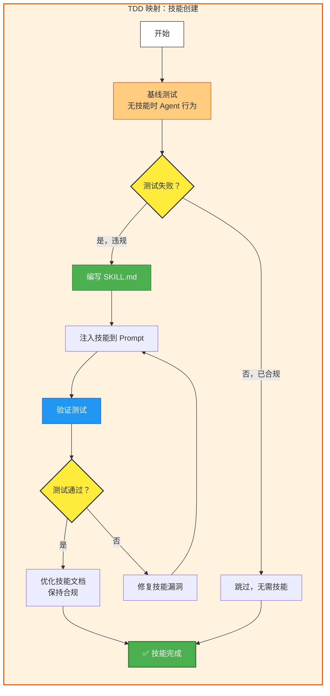
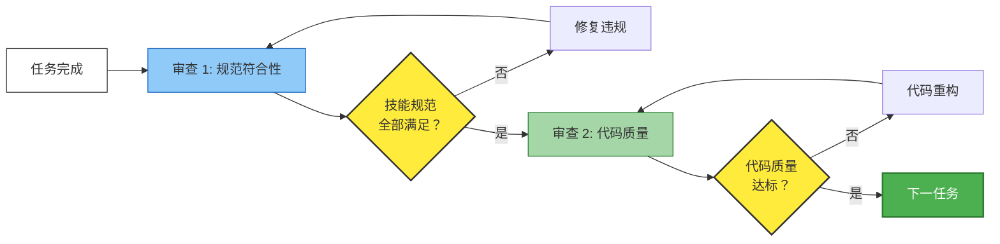
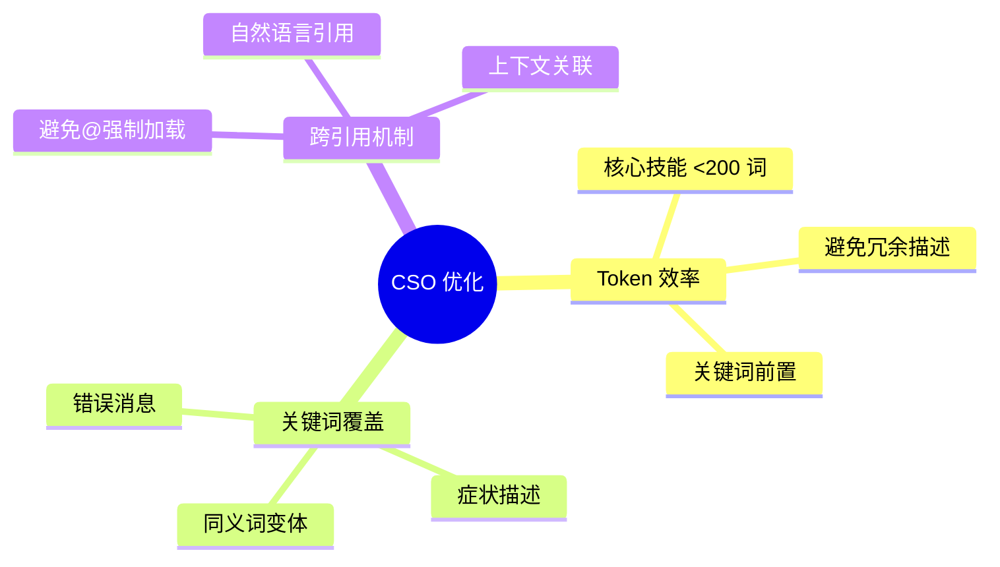
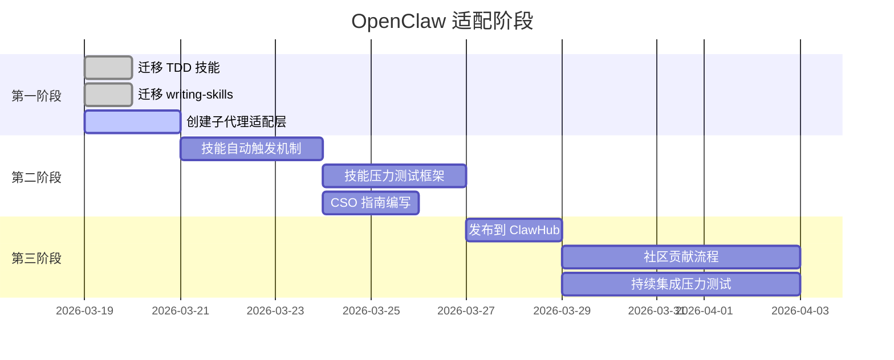

# 猎物 #001: obra/superpowers - 架构流程图

**天枢计划 | Mermaid 文本架构图**  
**创建日期**: 2026-03-19  
**原项目**: [obra/superpowers](https://github.com/obra/superpowers)

---

## 🏗️ 核心架构总览

---

## 🔄 技能触发机制

---

## 📋 核心技能矩阵与触发流程

---

## 🔁 TDD 工作流映射 (技能编写)

---

## 🔍 两级审查流程

---

## 📊 CSO (Claude Search Optimization) 原则

---

## 🎯 OpenClaw 适配路线图

---

## 📝 图例说明

| 颜色 | 含义 |
|------|------|
| 🟩 绿色 | 合规/成功/完成状态 |
| 🟨 黄色 | 决策点/条件判断 |
| 🟦 蓝色 | 处理步骤/操作 |
| 🟧 橙色 | 警告/基线测试 |
| 🟪 紫色 | 技能矩阵/分组 |

---

**图表生成**: Aegis-1 (天枢计划执行引擎)  
**Mermaid 版本**: 10.x (GitHub 原生支持)  
**渲染说明**: 将本文件放入 GitHub 仓库即可自动渲染流程图
