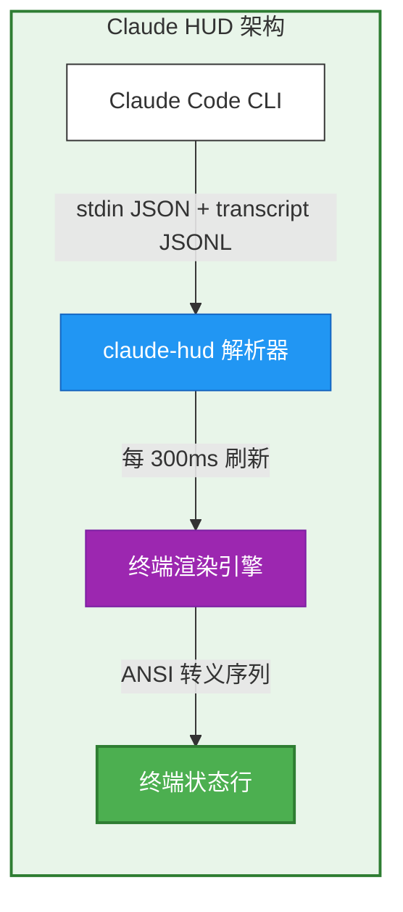
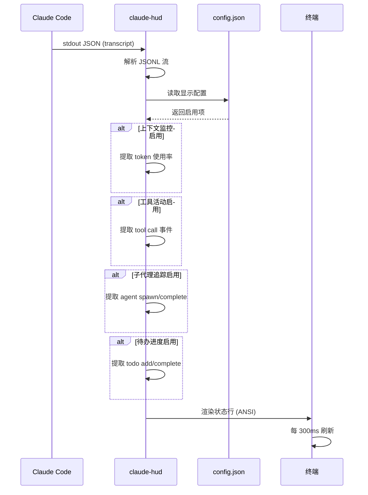
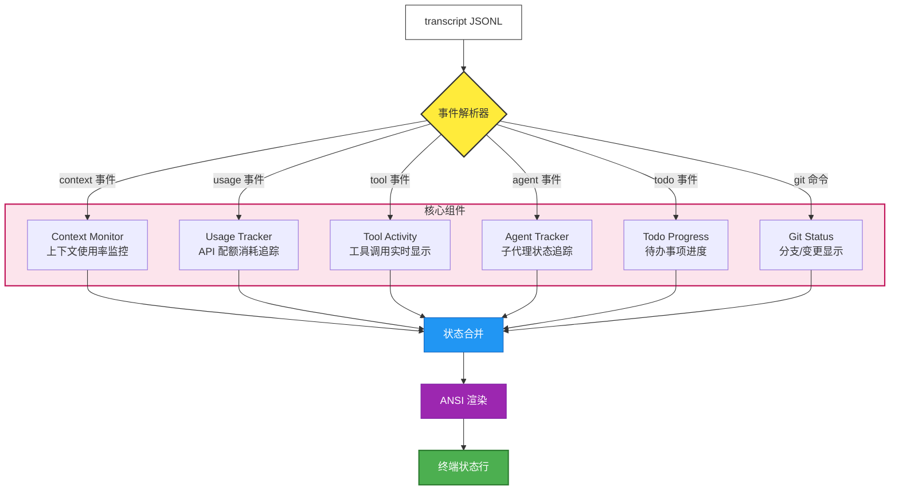
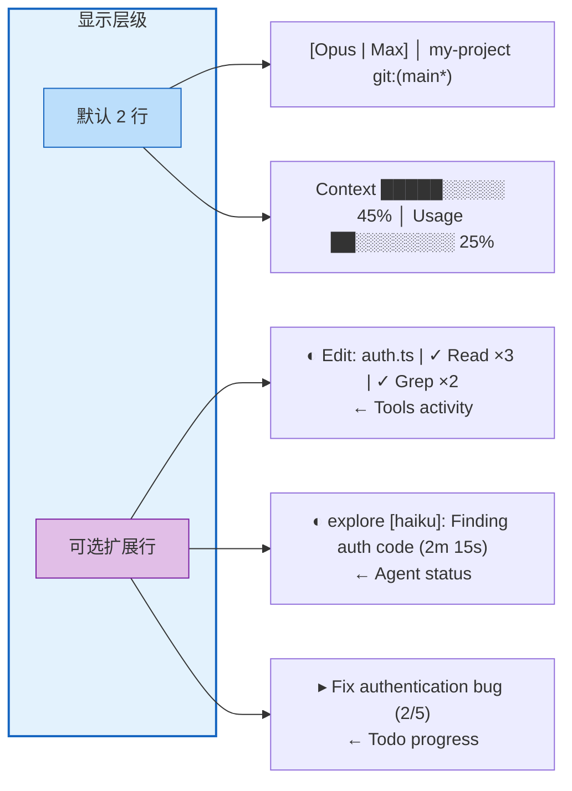
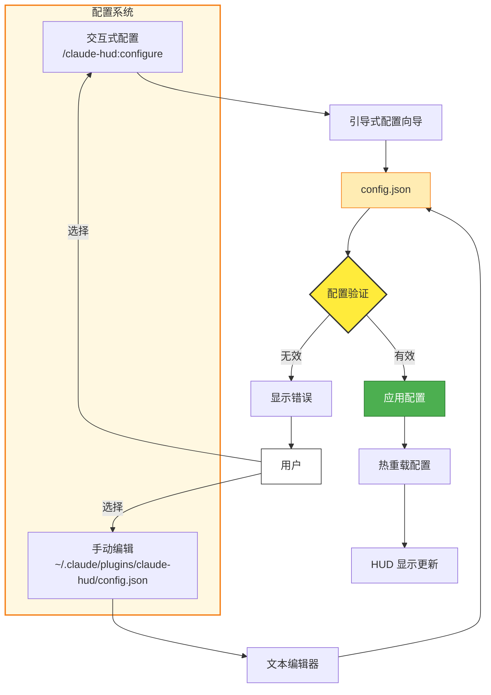
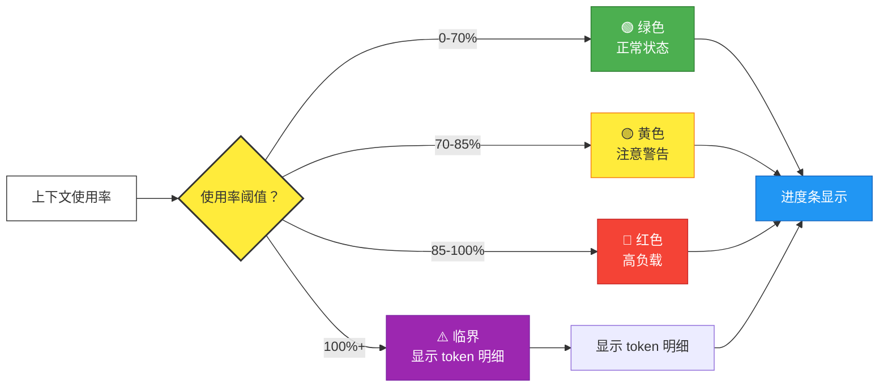
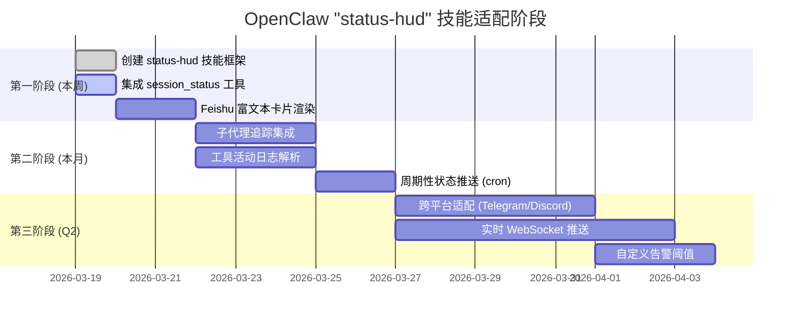
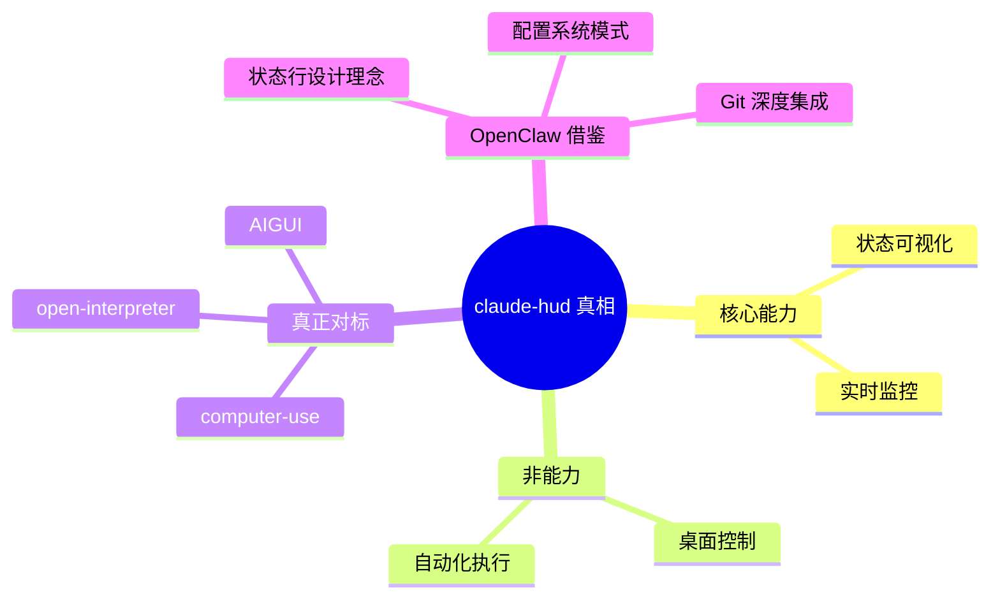

# 猎物 #002: jarrodwatts/claude-hud - 架构流程图

**天枢计划 | Mermaid 文本架构图**  
**创建日期**: 2026-03-19  
**原项目**: [jarrodwatts/claude-hud](https://github.com/jarrodwatts/claude-hud)

---

## 🏗️ 核心架构总览

---

## 📊 数据流架构

---

## 🎛️ 核心组件架构

---

## 🎨 显示层级配置

---

## ⚙️ 配置系统架构

---

## 🔍 上下文健康预警机制

---

## 📐 OpenClaw 适配路线图

---

## 🎯 核心洞察

---

## 📝 图例说明

| 颜色 | 含义 |
|------|------|
| 🟩 绿色 | 正常状态/成功 |
| 🟨 黄色 | 警告/决策点 |
| 🟦 蓝色 | 处理步骤/数据流 |
| 🟪 紫色 | 渲染/转换 |
| 🟧 橙色 | 配置/设置 |
| 🟥 红色 | 错误/临界状态 |

---

**图表生成**: Aegis-1 (天枢计划执行引擎)  
**Mermaid 版本**: 10.x (GitHub 原生支持)  
**渲染说明**: 将本文件放入 GitHub 仓库即可自动渲染流程图
