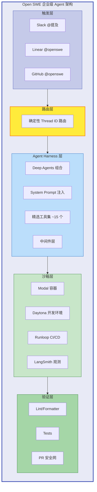
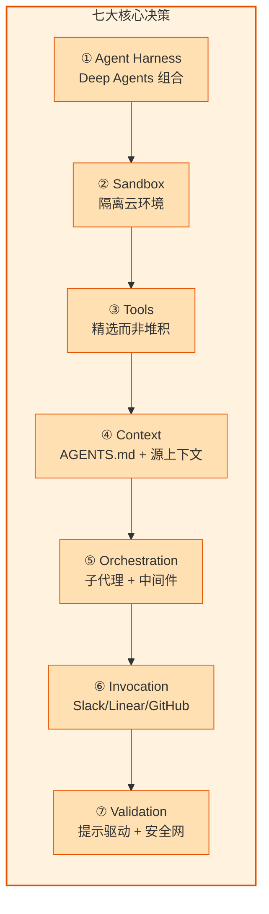
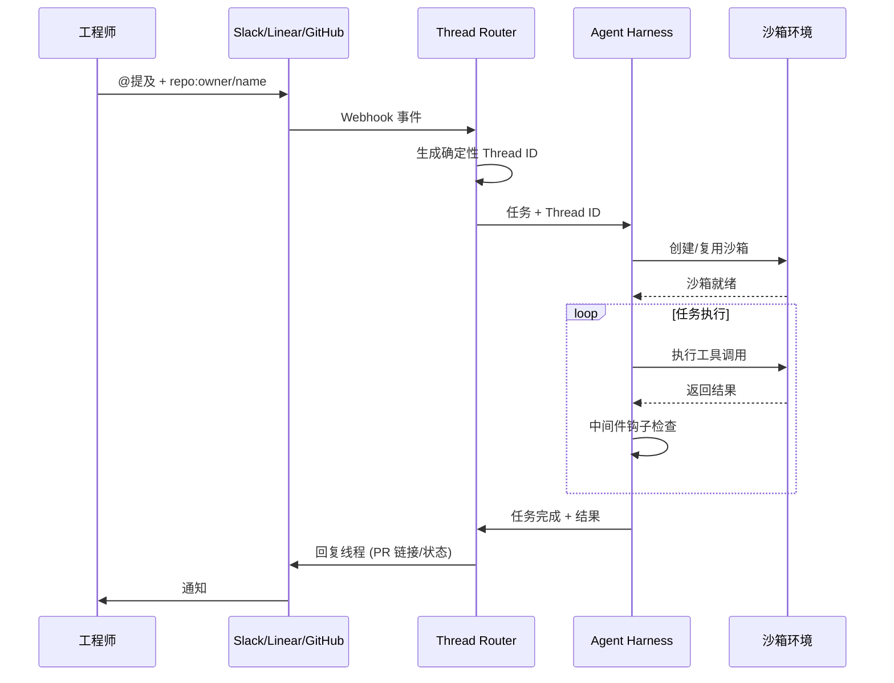
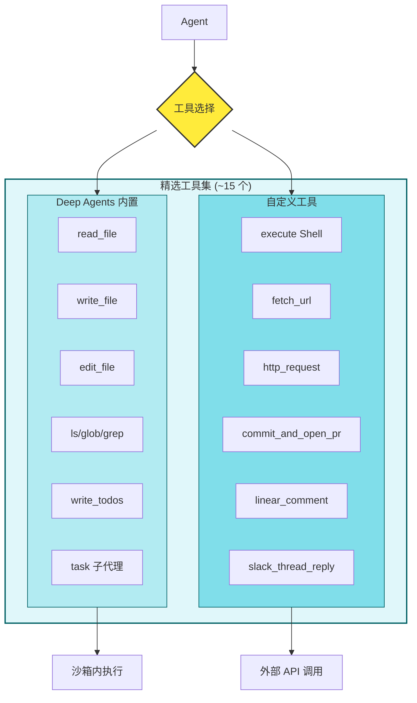
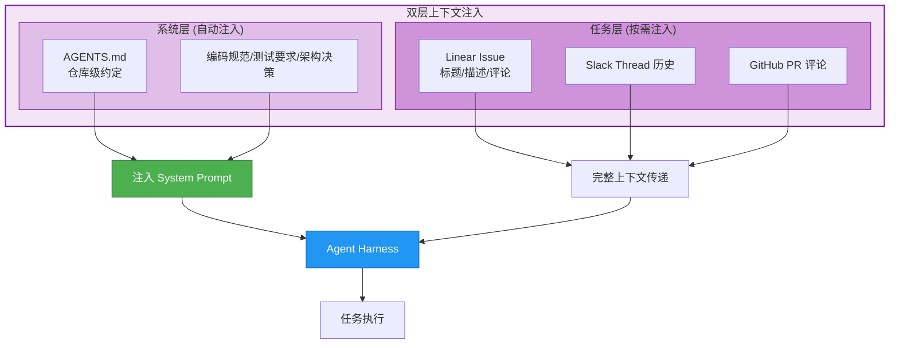
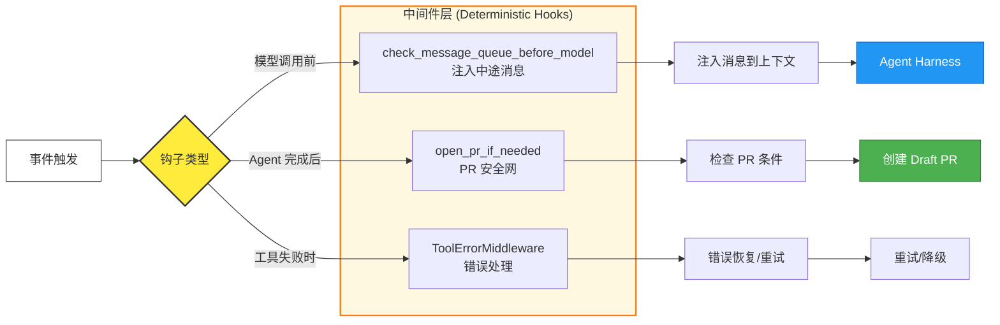
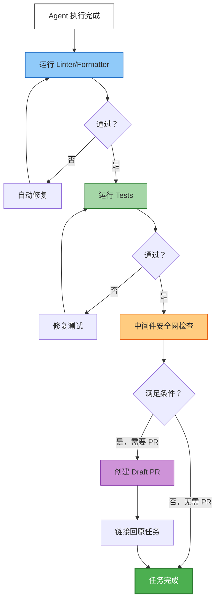
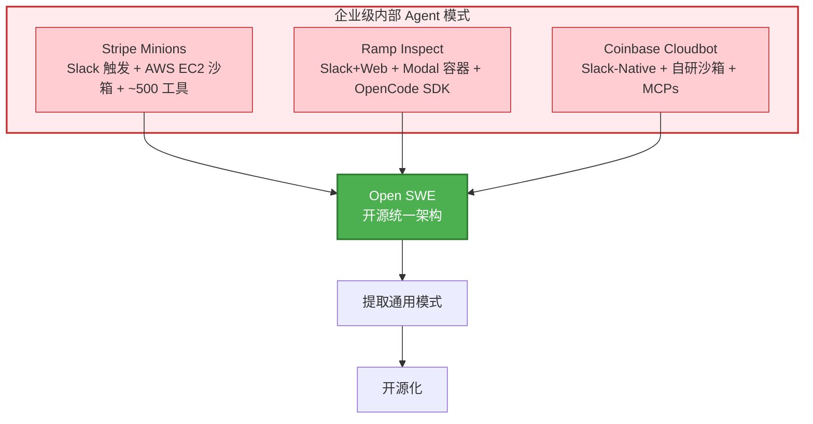
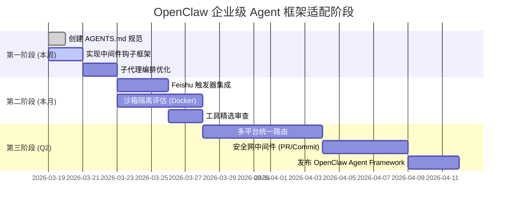

# 猎物 #003: langchain-ai/open-swe - 架构流程图

**天枢计划 | Mermaid 文本架构图**  
**创建日期**: 2026-03-19  
**原项目**: [langchain-ai/open-swe](https://github.com/langchain-ai/open-swe)

---

## 🏗️ 核心架构总览

---

## 🔄 七大核心架构决策

---

## 📡 多平台触发与路由

---

## 🧰 精选工具集架构

---

## 📚 双层上下文注入

---

## 🔧 中间件钩子 (确定性执行)

---

## 🔍 多层验证流程

---

## 🏢 企业对标分析

---

## 📐 OpenClaw 适配路线图

---

## 📝 图例说明

| 颜色 | 含义 |
|------|------|
| 🟩 绿色 | 成功/完成/安全状态 |
| 🟨 黄色 | 决策点/条件判断 |
| 🟦 蓝色 | 处理步骤/数据流 |
| 🟪 紫色 | 外部集成/API |
| 🟧 橙色 | 配置/中间件 |
| 🟥 红色 | 企业级/警告 |

---

**图表生成**: Aegis-1 (天枢计划执行引擎)  
**Mermaid 版本**: 10.x (GitHub 原生支持)  
**渲染说明**: 将本文件放入 GitHub 仓库即可自动渲染流程图
