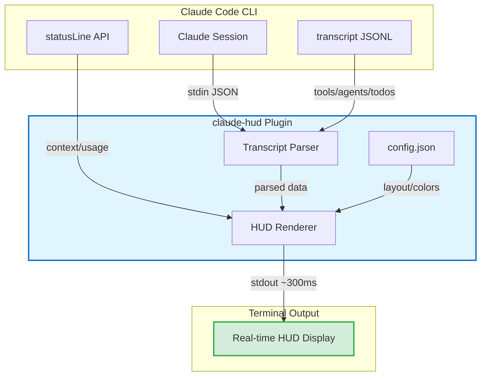
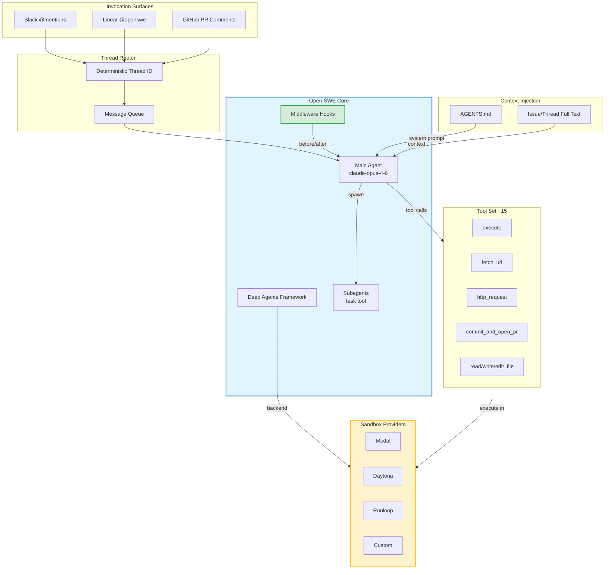
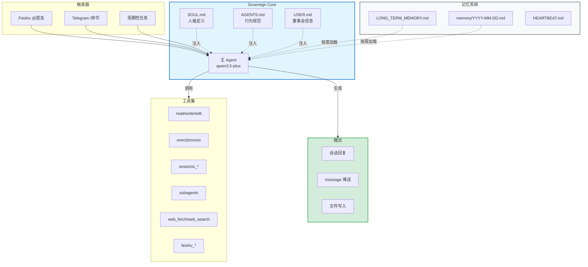
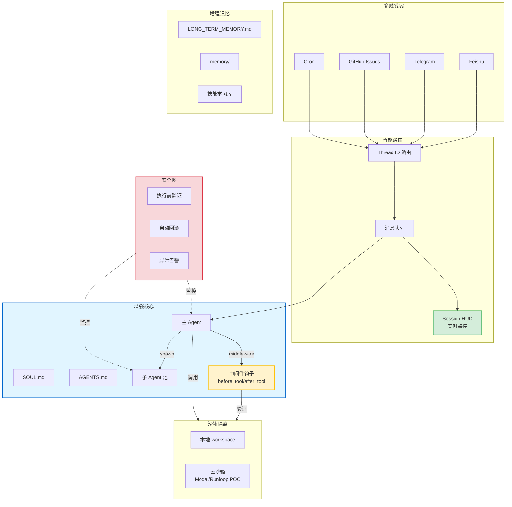

# 猎物 #004 架构图

**生成日期**: 2026-03-21  
**工具**: Mermaid  
**来源**: claude-hud + open-swe 架构分析

---

## 📊 claude-hud 架构

---

## 📊 open-swe 架构

---

## 📊 OpenClaw 当前架构

---

## 📊 OpenClaw 目标架构 (融合 claude-hud + open-swe)

---

## 🔑 架构演进关键点

| 阶段 | 目标 | 关键组件 |
|------|------|----------|
| **当前** | 基础 Agent 功能 | SOUL/AGENTS/USER + tools |
| **短期** | 可观测性增强 | Session HUD + 中间件钩子 |
| **中期** | 沙箱隔离 | 云沙箱 POC + 子 Agent 隔离 |
| **长期** | 企业级框架 | 多触发器 + 安全网 + 自动回滚 |

---

**生成者**: Sovereign (S.V.) 👁️  
**格式**: Mermaid (GitHub/Feishu 原生支持)
