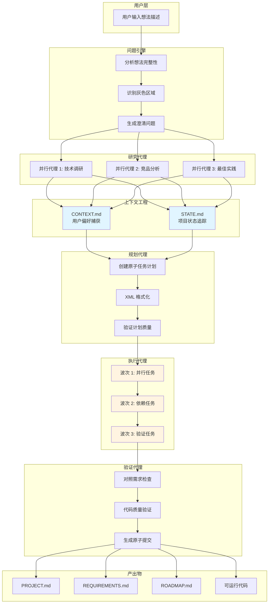
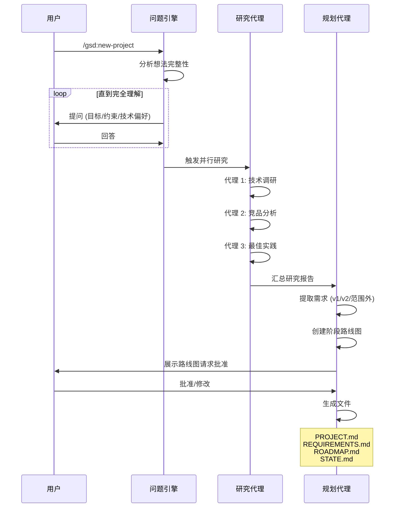
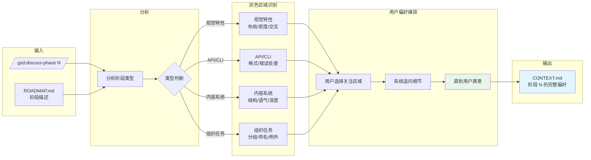
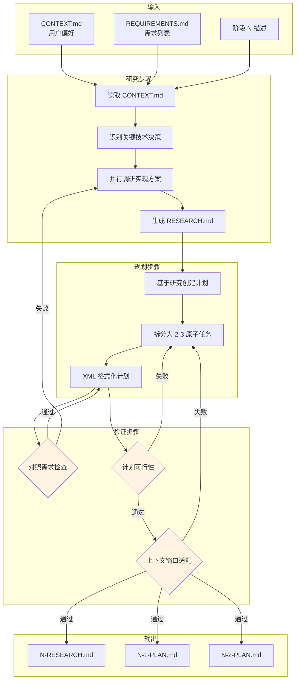
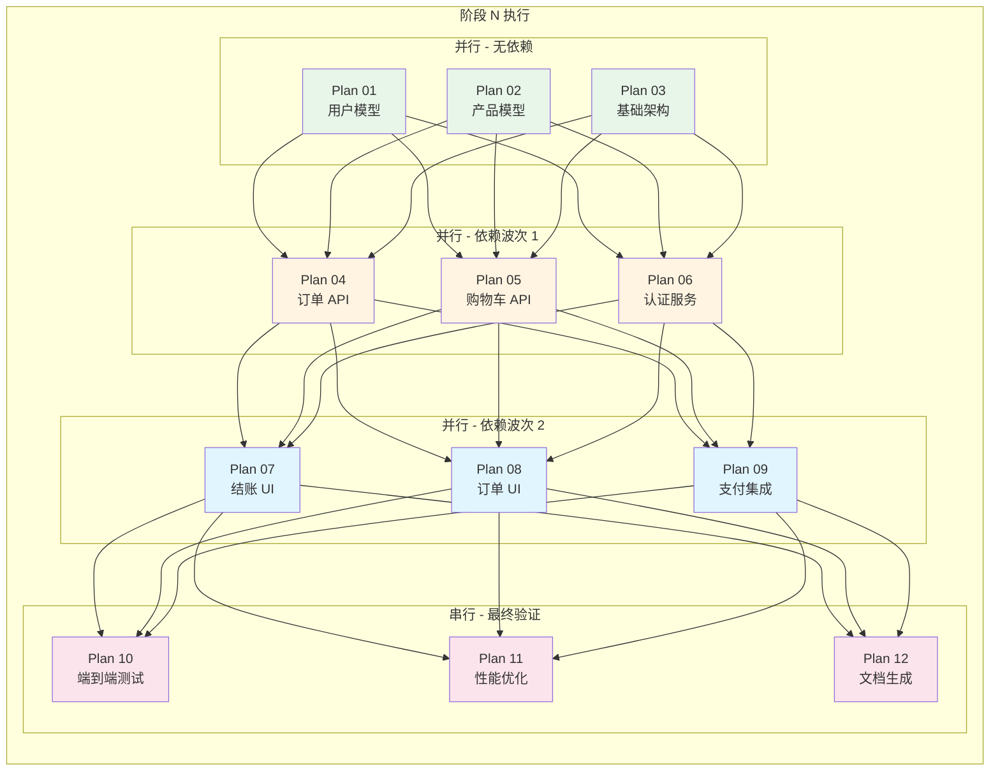
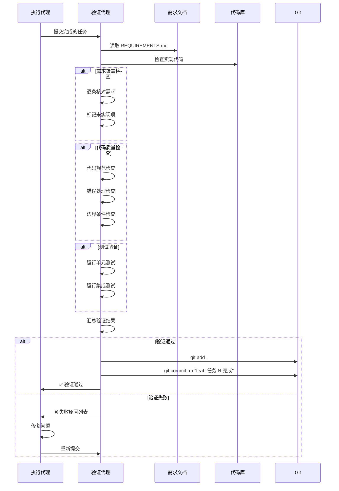
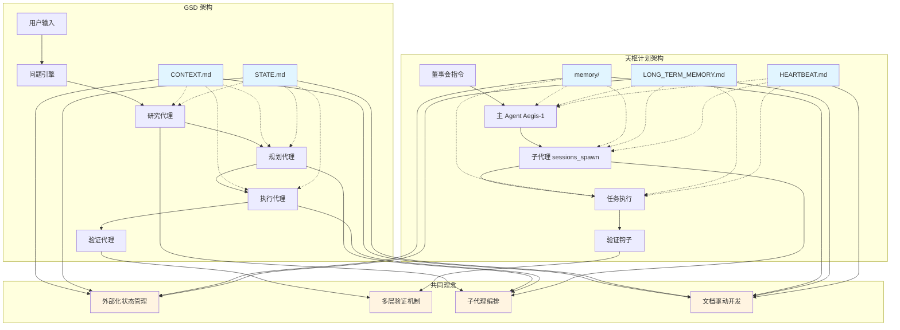

# 猎物 #004: GSD - Mermaid 架构图

**项目**: gsd-build/get-shit-done  
**拆解时间**: 2026-03-20  
**图表数量**: 8 张

---

## 图 1: GSD 系统架构总览



---

## 图 2: 项目初始化流程



---

## 图 3: 讨论阶段详细流程



---

## 图 4: 规划阶段详细流程



---

## 图 5: 执行阶段波次调度



---

## 图 6: 上下文管理策略对比

```mermaid
graph TB
    subgraph 传统方式 [传统对话方式]
        T1[对话历史 1<br/>5000 tokens]
        T2[对话历史 2<br/>5000 tokens]
        T3[...更多历史]
        T4[当前任务<br/>剩余 tokens]
        
        T1 --> T2 --> T3 --> T4
        T4 --> T5[⚠️ 上下文窗口满]
        T5 --> T6[AI 开始降级行为<br/>"我会更简洁"]
        T6 --> T7[代码质量下降]
    end
    
    subgraph GSD 方式 [GSD 外部化方式]
        G1[CONTEXT.md<br/>关键决策]
        G2[STATE.md<br/>项目状态]
        G3[当前计划<br/>XML 结构]
        G4[新鲜上下文<br/>200k tokens 可用]
        
        G1 & G2 & G3 --> G4
        G4 --> G5[✅ 高质量输出]
        G5 --> G6[原子提交]
    end
    
    style T5 fill:#ffcdd2
    style T6 fill:#ffcdd2
    style T7 fill:#ffcdd2
    style G4 fill:#c8e6c9
    style G5 fill:#c8e6c9
    style G6 fill:#c8e6c9
```

---

## 图 7: 验证代理工作流程



---

## 图 8: GSD 与天枢计划架构对比



---

**图表生成完成**: 2026-03-20 08:35 CST  
**生成者**: Aegis-1 👁️
