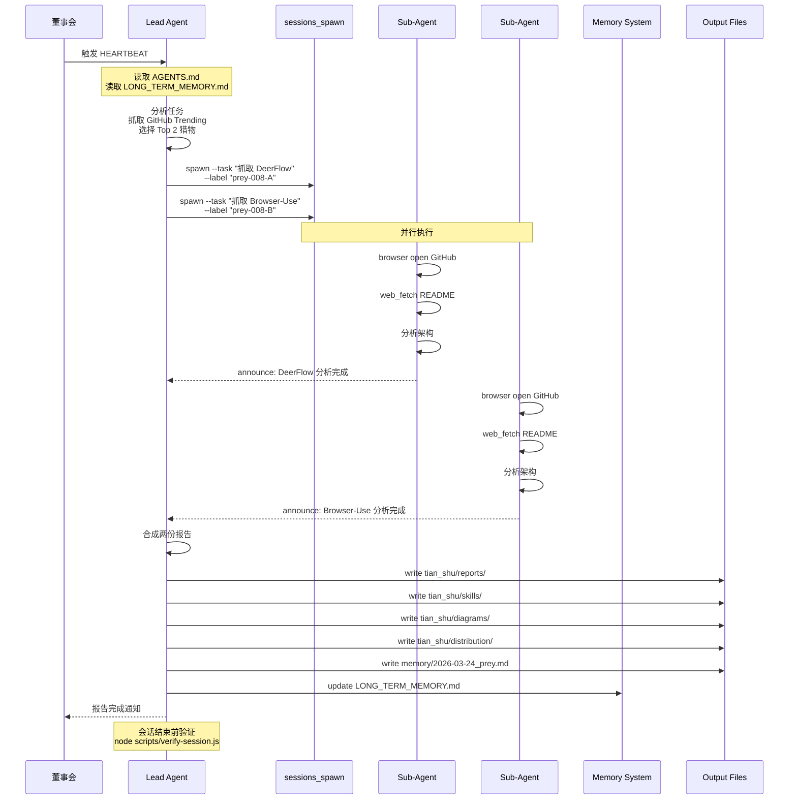
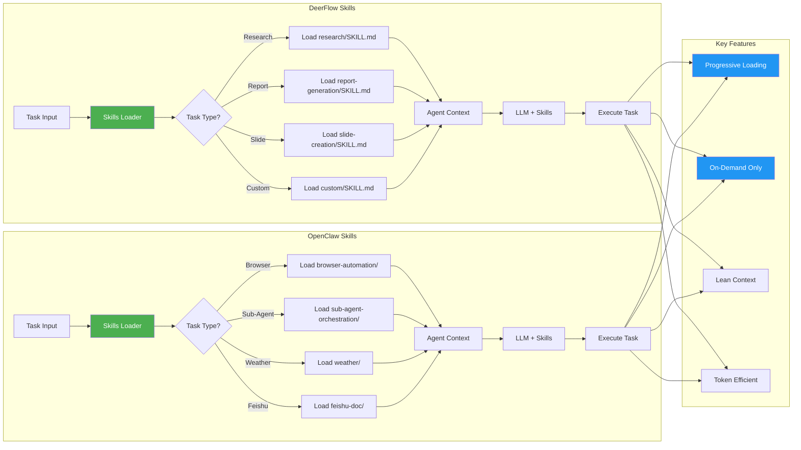
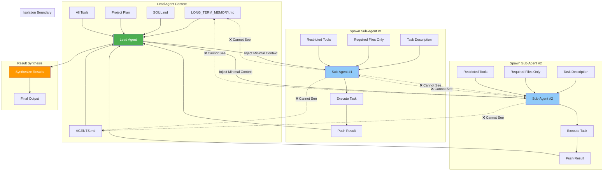

# 猎物 #008 架构对比图

**生成日期**: 2026-03-24  
**工具**: Mermaid  
**来源**: DeerFlow + Browser-Use 深度分析

---

## 图 1: DeerFlow 2.0 整体架构

```mermaid
graph TB
    subgraph "User Layer"
        A[用户] --> B[IM Channels]
        A --> C[Claude Code CLI]
        A --> D[Web UI localhost:2026]
    end
    
    subgraph "Gateway Layer"
        B --> E[Message Gateway]
        C --> E
        D --> E
        E --> F[Session Manager]
    end
    
    subgraph "Agent Core"
        F --> G[Lead Agent]
        G --> H[Context Engine]
        G --> I[Planner]
        G --> J[Sub-Agent Orchestrator]
    end
    
    subgraph "Sub-Agents"
        J --> K[Sub-Agent #1]
        J --> L[Sub-Agent #2]
        J --> M[Sub-Agent #N]
        K --> N[Isolated Context #1]
        L --> O[Isolated Context #2]
        M --> P[Isolated Context #N]
    end
    
    subgraph "Skills & Tools"
        G --> Q[Skills Loader]
        Q --> R[Public Skills]
        Q --> S[Custom Skills]
        R --> T[Research Skill]
        R --> U[Report Generation]
        R --> V[Slide Creation]
        S --> W[User Skills]
        
        G --> X[Tools Registry]
        X --> Y[Web Search]
        X --> Z[Web Fetch]
        X --> AA[Bash Execution]
        X --> AB[MCP Servers]
    end
    
    subgraph "Memory System"
        G --> AC[Short-Term Memory]
        G --> AD[Long-Term Memory]
        AC --> AE[Session Context]
        AD --> AF[User Profile]
        AD --> AG[Preferences]
        AD --> AH[Accumulated Knowledge]
    end
    
    subgraph "Sandbox Execution"
        G --> AI[Sandbox Manager]
        AI --> AJ[Docker Container #1]
        AI --> AK[Docker Container #N]
        AJ --> AL[/mnt/user-data/uploads]
        AJ --> AM[/mnt/user-data/workspace]
        AJ --> AN[/mnt/user-data/outputs]
        AJ --> AO[/mnt/skills/public]
        AJ --> AP[/mnt/skills/custom]
    end
    
    subgraph "LLM Providers"
        G --> AQ[Model Router]
        AQ --> AR[Doubao-Seed-2.0-Code]
        AQ --> AS[DeepSeek v3.2]
        AQ --> AT[Kimi 2.5]
        AQ --> AU[GPT-4/Claude/Gemini]
    end
    
    subgraph "External Services"
        AB --> AV[InfoQuest API]
        AB --> AW[Tavily Search]
        Y --> AX[Search Engines]
        Z --> AY[Web Pages]
    end
    
    style G fill:#4CAF50,color:#fff
    style J fill:#2196F3,color:#fff
    style K fill:#90CAF9
    style L fill:#90CAF9
    style M fill:#90CAF9
```

---

## 图 2: Browser-Use 架构

```mermaid
graph TB
    subgraph "User Interface"
        A[Python Code] --> B[Agent API]
        C[CLI Commands] --> D[Browser-Use CLI]
        E[Claude Code] --> F[Browser-Use Skill]
    end
    
    subgraph "Core Components"
        B --> G[Agent]
        D --> G
        F --> G
        
        G --> H[Task Parser]
        G --> I[LLM Client]
        G --> J[Browser Controller]
        G --> K[Tools Registry]
    end
    
    subgraph "LLM Providers"
        I --> L[ChatBrowserUse]
        I --> M[ChatGoogle]
        I --> N[ChatAnthropic]
        I --> O[ChatOpenAI]
        I --> P[Ollama Local]
    end
    
    subgraph "Browser Layer"
        J --> Q[Playwright]
        J --> R[Puppeteer]
        
        Q --> S[Chrome/Chromium]
        R --> S
        
        S --> T[Local Browser]
        S --> U[Cloud Browser]
    end
    
    subgraph "Cloud Services"
        U --> V[Browser Use Cloud]
        V --> W[Proxy Rotation]
        V --> X[CAPTCHA Solving]
        V --> Y[1000+ Integrations]
        V --> Z[Persistent Storage]
    end
    
    subgraph "DOM Interaction"
        J --> AA[DOM Parser]
        AA --> AB[Aria Refs]
        AA --> AC[Role Refs]
        AA --> AD[Selector Engine]
        
        AA --> AE[Click Action]
        AA --> AF[Type Action]
        AA --> AG[Hover Action]
        AA --> AH[Select Action]
        AA --> AI[Screenshot]
    end
    
    subgraph "Custom Tools"
        K --> AJ[User Tools]
        AJ --> AK[@tools.action Decorator]
        AK --> AL[Custom Python Functions]
    end
    
    subgraph "Session Management"
        G --> AM[Session State]
        AM --> AN[Browser Profile]
        AM --> AO[Cookie Storage]
        AM --> AP[Local Storage]
    end
    
    subgraph "Output"
        G --> AQ[Task Result]
        AQ --> AR[Text Output]
        AQ --> AS[Screenshots]
        AQ --> AT[File Downloads]
    end
    
    style G fill:#4CAF50,color:#fff
    style J fill:#2196F3,color:#fff
    style V fill:#FF9800,color:#fff
```

---

## 图 3: OpenClaw 适配架构 (融合 DeerFlow + Browser-Use)

```mermaid
graph TB
    subgraph "User Channels"
        A[Feishu] --> B[Message Gateway]
        C[Telegram] --> B
        D[WebChat] --> B
        E[Cron Jobs] --> F[Task Scheduler]
    end
    
    subgraph "Agent Core (Sovereign)"
        B --> G[Lead Agent]
        F --> G
        
        G --> H[Context Manager]
        G --> I[Tool Router]
        G --> J[Sub-Agent Manager]
    end
    
    subgraph "Context System"
        H --> K[AGENTS.md]
        H --> L[SOUL.md]
        H --> M[LONG_TERM_MEMORY.md]
        H --> N[memory/YYYY-MM-DD.md]
        H --> O[Project Docs]
    end
    
    subgraph "Sub-Agents"
        J --> P[sessions_spawn]
        P --> Q[Sub-Agent #1]
        P --> R[Sub-Agent #2]
        P --> S[Sub-Agent #N]
        
        Q --> T[Isolated Session #1]
        R --> U[Isolated Session #2]
        S --> V[Isolated Session #N]
        
        Q --> W[Push-based Announce]
        R --> W
        S --> W
        W --> G
    end
    
    subgraph "Skills System"
        G --> X[Skills Loader]
        X --> Y[tian_shu/skills/]
        Y --> Z[browser-automation/SKILL.md]
        Y --> AA[sub-agent-orchestration/SKILL.md]
        Y --> AB[weather/SKILL.md]
        Y --> AC[feishu-doc/SKILL.md]
        
        X --> AD[Progressive Loading]
        AD --> AE[Load on Demand]
    end
    
    subgraph "Tool Layer"
        I --> AF[read/write/edit]
        I --> AG[exec/process]
        I --> AH[browser]
        I --> AI[web_search/web_fetch]
        I --> AJ[feishu_* tools]
        I --> AK[message/tts]
        I --> AL[subagents]
    end
    
    subgraph "Browser Automation"
        AH --> AM[OpenClaw Browser]
        AM --> AN[Snapshot (aria refs)]
        AM --> AO[Act (click/type)]
        AM --> AP[Screenshot]
        AM --> AQ[Chrome Extension Relay]
        
        AH --> AR[Browser-Use Integration]
        AR --> AS[Python Library]
        AR --> AT[Cloud API (Optional)]
    end
    
    subgraph "Memory & Storage"
        G --> AU[Session Memory]
        G --> AV[Long-Term Memory]
        
        AU --> AW[Current Session Context]
        AV --> AX[LONG_TERM_MEMORY.md]
        AV --> AY[Project State]
        AV --> AZ[User Preferences]
        
        AW --> BA[memory/YYYY-MM-DD.md]
    end
    
    subgraph "Output & Distribution"
        G --> BB[Result Synthesizer]
        BB --> BC[tian_shu/reports/]
        BB --> BD[tian_shu/diagrams/]
        BB --> BE[tian_shu/distribution/]
        BB --> BF[Feishu Message]
        BB --> BG[Telegram Message]
    end
    
    subgraph "External Services"
        AI --> BH[Brave Search API]
        AJ --> BI[Feishu Open Platform]
        AF --> BJ[File System]
        AG --> BK[Shell Commands]
    end
    
    style G fill:#4CAF50,color:#fff
    style J fill:#2196F3,color:#fff
    style P fill:#90CAF9
    style X fill:#FF9800,color:#fff
    style AM fill:#00BCD4,color:#fff
```

---

## 图 4: 猎物拆解工作流 (HEARTBEAT #004)



---

## 图 5: Skills 加载机制对比



---

## 图 6: Sub-Agent 上下文隔离



---

**图表说明**:
- 图 1-2: 原始项目架构 (DeerFlow / Browser-Use)
- 图 3: OpenClaw 融合架构 (适配后)
- 图 4: 猎物拆解工作流 (本次任务)
- 图 5: Skills 加载机制对比
- 图 6: Sub-Agent 上下文隔离设计

**生成工具**: Mermaid  
**兼容性**: GitHub / GitLab / Notion / Obsidian
