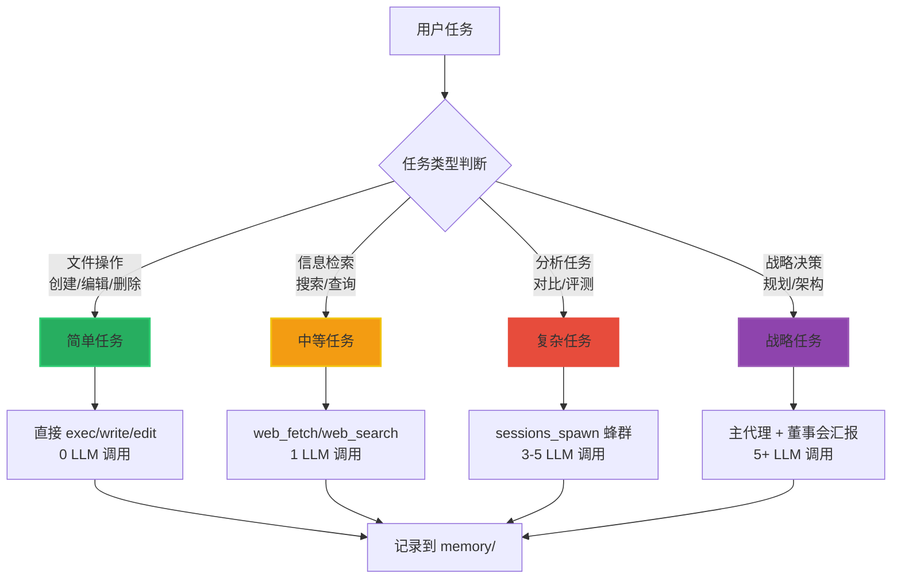

# 猎物 #009 架构图

**分析对象**: Ruflo + last30days 双项目架构对比  
**图表格式**: Mermaid  
**天枢计划**: Prey #009

---

## Ruflo 完整架构图

```mermaid
flowchart TB
    subgraph USER["👤 User Layer"]
        U[User]
    end

    subgraph ENTRY["🚪 Entry Layer"]
        CLI[CLI / MCP Server]
        AID[AIDefence Security]
    end

    subgraph ROUTING["🧭 Routing Layer"]
        QL[Q-Learning Router]
        MOE[MoE - 8 Experts]
        SK[Skills - 130+]
        HK[Hooks - 27]
    end

    subgraph SWARM["🐝 Swarm Coordination"]
        TOPO[Topologies<br/>mesh/hier/ring/star]
        CONS[Consensus<br/>Raft/BFT/Gossip/CRDT]
        CLM[Claims<br/>Human-Agent Coord]
    end

    subgraph AGENTS["🤖 100+ Agents"]
        AG1[coder]
        AG2[tester]
        AG3[reviewer]
        AG4[architect]
        AG5[security]
        AG6[...]
    end

    subgraph RESOURCES["📦 Resources"]
        MEM[(Memory<br/>AgentDB)]
        PROV[Providers<br/>Claude/GPT/Gemini/Ollama]
        WORK[Workers - 12<br/>ultralearn/audit/optimize]
    end

    subgraph RUVECTOR["🧠 RuVector Intelligence Layer"]
        direction TB
        subgraph ROW1[" "]
            SONA[SONA<br/>Self-Optimize<br/><0.05ms]
            EWC[EWC++<br/>No Forgetting]
            FLASH[Flash Attention<br/>2.49-7.47x]
        end
        subgraph ROW2[" "]
            HNSW[HNSW<br/>150x-12,500x faster]
            RB[ReasoningBank<br/>Pattern Store]
            HYP[Hyperbolic<br/>Poincaré]
        end
        subgraph ROW3[" "]
            LORA[LoRA/Micro<br/>128x compress]
            QUANT[Int8 Quant<br/>3.92x memory]
            RL[9 RL Algos<br/>Q/SARSA/PPO/DQN]
        end
    end

    subgraph LEARNING["🔄 Learning Loop"]
        L1[RETRIEVE] --> L2[JUDGE] --> L3[DISTILL] --> L4[CONSOLIDATE] --> L5[ROUTE]
    end

    U --> CLI
    CLI --> AID
    AID --> QL & MOE & SK & HK
    QL & MOE & SK & HK --> TOPO & CONS & CLM
    TOPO & CONS & CLM --> AG1 & AG2 & AG3 & AG4 & AG5 & AG6
    AG1 & AG2 & AG3 & AG4 & AG5 & AG6 --> MEM & PROV & WORK
    MEM --> SONA & EWC & FLASH
    SONA & EWC & FLASH --> HNSW & RB & HYP
    HNSW & RB & HYP --> LORA & QUANT & RL
    LORA & QUANT & RL --> L1
    L5 -.->|loops back| QL

    style RUVECTOR fill:#1a1a2e,stroke:#e94560,stroke-width:2px
    style LEARNING fill:#0f3460,stroke:#e94560,stroke-width:2px
    style USER fill:#16213e,stroke:#0f3460
    style ENTRY fill:#1a1a2e,stroke:#0f3460
    style ROUTING fill:#1a1a2e,stroke:#0f3460
    style SWARM fill:#1a1a2e,stroke:#0f3460
    style AGENTS fill:#1a1a2e,stroke:#0f3460
    style RESOURCES fill:#1a1a2e,stroke:#0f3460
```

---

## Ruflo 简化架构 (OpenClaw 适配版)

```mermaid
flowchart TB
    subgraph USER["👤 User Layer"]
        U[OpenClaw User]
    end

    subgraph ENTRY["🚪 Entry Layer"]
        CLI[OpenClaw CLI]
        AGENTS[AGENTS.md Hooks]
    end

    subgraph ROUTING["🧭 Routing Layer"]
        INTENT[Intent Parser]
        SKILLS[OpenClaw Skills]
    end

    subgraph SWARM["🐝 Swarm Coordination"]
        HIER[Hierarchical Topology<br/>maxAgents:8]
        RAFT[Raft Consensus<br/>Simplified]
    end

    subgraph AGENTS["🤖 Subagents"]
        SA1[Subagent 1]
        SA2[Subagent 2]
        SA3[Subagent 3]
        SA4[...]
    end

    subgraph RESOURCES["📦 Resources"]
        MEM[(memory/*.md)]
        LTM[LONG_TERM_MEMORY.md]
        PROV[LLM Providers<br/>Dashscope/Ollama]
    end

    subgraph OPTIMIZE["⚡ Optimization"]
        SKIP[Skip LLM for Simple Tasks]
        CTX[Context Cleaner]
    end

    U --> CLI
    CLI --> AGENTS
    AGENTS --> INTENT & SKILLS
    INTENT -->|Simple| SKIP
    INTENT -->|Complex| HIER
    SKILLS --> SA1 & SA2 & SA3
    HIER & RAFT --> SA1 & SA2 & SA3 & SA4
    SA1 & SA2 & SA3 & SA4 --> MEM & LTM & PROV
    MEM --> CTX
    CTX -.->|feedback| INTENT

    style OPTIMIZE fill:#1a1a2e,stroke:#e94560,stroke-width:2px
    style USER fill:#16213e,stroke:#0f3460
    style ENTRY fill:#1a1a2e,stroke:#0f3460
    style ROUTING fill:#1a1a2e,stroke:#0f3460
    style SWARM fill:#1a1a2e,stroke:#0f3460
    style AGENTS fill:#1a1a2e,stroke:#0f3460
    style RESOURCES fill:#1a1a2e,stroke:#0f3460
```

---

## last30days 架构图

```mermaid
flowchart TB
    subgraph USER["👤 User Layer"]
        U[Claude Code / OpenClaw User]
    end

    subgraph PARSE["🔍 Intent Parser"]
        TOPIC[Extract TOPIC]
        TOOL[Extract TARGET_TOOL]
        TYPE[Extract QUERY_TYPE]
    end

    subgraph ROUTE["🧭 Command Routing"]
        WATCH[watch]
        BRIEF[briefing]
        HIST[history]
        RESEARCH[research]
    end

    subgraph SOURCES["📡 10 Signal Sources"]
        REDDIT[Reddit<br/>ScrapeCreators]
        X[X/Twitter<br/>AUTH_TOKEN or XAI]
        BSKY[Bluesky<br/>AT Protocol]
        TRUTH[Truth Social]
        YT[YouTube<br/>yt-dlp]
        TK[TikTok<br/>ScrapeCreators]
        IG[Instagram Reels<br/>ScrapeCreators]
        HN[Hacker News]
        POLY[Polymarket]
        WEB[Web Search<br/>Parallel/Brave]
    end

    subgraph SCORING["🎯 Quality Scoring"]
        TEXT[Text Similarity<br/>+ Synonym Expansion]
        ENG[Engagement Velocity<br/>Normalization]
        AUTH[Source Authority<br/>Weighting]
        CONV[Cross-Platform<br/>Convergence]
        TIME[Temporal<br/>Recency Decay]
    end

    subgraph SYNTH["🤖 Synthesis Engine"]
        JUDGE[Judge Agent]
        PATTERN[Pattern Detection]
        CONTRADICT[Contradiction Check]
        INSIGHT[Extract Insights]
    end

    subgraph OUTPUT["📄 Output"]
        REPORT[Research Report]
        STATS[Research Stats]
        SAVE[Auto-save to<br/>~/Documents/Last30Days/]
    end

    subgraph MEMORY["💾 Memory (Open Variant)"]
        DB[(SQLite<br/>research.db)]
        BRIEFS[Briefings/]
    end

    U --> PARSE
    PARSE --> TOPIC & TOOL & TYPE
    TYPE --> ROUTE
    ROUTE -->|watch| WATCH
    ROUTE -->|briefing| BRIEF
    ROUTE -->|history| HIST
    ROUTE -->|default| RESEARCH
    
    RESEARCH --> SOURCES
    SOURCES --> SCORING
    SCORING --> SYNTH
    SYNTH --> OUTPUT
    OUTPUT --> SAVE
    
    WATCH & BRIEF & HIST --> MEMORY
    MEMORY --> DB & BRIEFS

    style PARSE fill:#1a1a2e,stroke:#e94560,stroke-width:2px
    style SCORING fill:#0f3460,stroke:#e94560,stroke-width:2px
    style MEMORY fill:#16213e,stroke:#0f3460
    style USER fill:#16213e,stroke:#0f3460
```

---

## 双项目对比架构

```mermaid
flowchart LR
    subgraph RUFLO["🌊 Ruflo"]
        R1[100+ Agents]
        R2[RuVector Intelligence]
        R3[5 Consensus Algorithms]
        R4[HNSW Vector Search]
        R5[Knowledge Graph]
    end

    subgraph LAST30["📰 last30days"]
        L1[10 Signal Sources]
        L2[Quality Scoring Pipeline]
        L3[Polymarket Integration]
        L4[SQLite Memory]
        L5[Watchlist + Briefings]
    end

    subgraph AETHER["👁️ Aether-Sync"]
        A1[On-Demand Subagents]
        A2[LONG_TERM_MEMORY.md]
        A3[Revenue Focus]
        A4[Market Dominance]
        A5[Board Reporting]
    end

    RUFLO -->|借鉴 | AETHER
    LAST30 -->|借鉴 | AETHER

    R2 -.->|简化 | A2
    R4 -.->|未来 | A2
    L1 -.->|竞争情报 | A4
    L4 -.->|理念 | A2

    style RUFLO fill:#1a1a2e,stroke:#e94560,stroke-width:2px
    style LAST30 fill:#0f3460,stroke:#e94560,stroke-width:2px
    style AETHER fill:#16213e,stroke:#0f3460,stroke-width:2px
```

---

## 记忆系统对比

```mermaid
flowchart TB
    subgraph RUFLO_MEM["Ruflo 记忆系统"]
        R_HNSW[HNSW 向量搜索<br/>~61µs, 16,400 QPS]
        R_GRAPH[知识图谱<br/>PageRank + 社区检测]
        R_COLLECTIVE[集体记忆<br/>8 种类型 + LRU]
        R_SQLITE[(SQLite WAL)]
        
        R_HNSW --> R_GRAPH
        R_GRAPH --> R_COLLECTIVE
        R_COLLECTIVE --> R_SQLITE
    end

    subgraph LAST30_MEM["last30days 记忆系统"]
        L_SQLITE[(SQLite research.db<br/>WAL Mode)]
        L_FULLTEXT[全文搜索]
        L_AUTO[自动保存<br/>~/Documents/Last30Days/]
        
        L_SQLITE --> L_FULLTEXT
        L_FULLTEXT --> L_AUTO
    end

    subgraph AETHER_MEM["Aether-Sync 记忆系统"]
        A_LTM[LONG_TERM_MEMORY.md<br/>Git 版本控制]
        A_SESSION[memory/YYYY-MM-DD.md<br/>会话日志]
        A_PROJECT[PROJECT_PLAN.md<br/>里程碑追踪]
        
        A_LTM --> A_SESSION
        A_SESSION --> A_PROJECT
    end

    RUFLO_MEM -.->|未来集成 | AETHER_MEM
    LAST30_MEM -.->|自动保存理念 | AETHER_MEM

    style RUFLO_MEM fill:#1a1a2e,stroke:#e94560,stroke-width:2px
    style LAST30_MEM fill:#0f3460,stroke:#e94560,stroke-width:2px
    style AETHER_MEM fill:#16213e,stroke:#0f3460,stroke-width:2px
```

---

## 蜂群协调对比

```mermaid
flowchart TB
    subgraph RUFLO_SWARM["Ruflo 蜂群"]
        R_QUEEN[Queen Agent]
        R_WORKERS[8 Worker Types<br/>Researcher/Coder/Analyst...]
        R_CONSENSUS[5 Consensus<br/>Raft/BFT/Gossip/Weighted/Majority]
        
        R_QUEEN --> R_WORKERS
        R_WORKERS --> R_CONSENSUS
    end

    subgraph LAST30_SWARM["last30days 蜂群"]
        L_SINGLE[Single Agent<br/>Research Mode]
        L_PARALLEL[Parallel Sources<br/>10 源同时搜索]
        L_SCORE[Quality Scoring<br/>5 因子加权]
        
        L_SINGLE --> L_PARALLEL
        L_PARALLEL --> L_SCORE
    end

    subgraph AETHER_SWARM["Aether-Sync 蜂群"]
        A_MAIN[Main Agent<br/>Sovereign/Queen]
        A_SUB[Subagents<br/>按需生成 ≤8]
        A_STEER[subagents steer<br/>实时调整]
        
        A_MAIN --> A_SUB
        A_SUB --> A_STEER
        A_STEER -.->|feedback| A_MAIN
    end

    RUFLO_SWARM -.->|hierarchical 模式 | AETHER_SWARM
    LAST30_SWARM -.->|并行搜索理念 | AETHER_SWARM

    style RUFLO_SWARM fill:#1a1a2e,stroke:#e94560,stroke-width:2px
    style LAST30_SWARM fill:#0f3460,stroke:#e94560,stroke-width:2px
    style AETHER_SWARM fill:#16213e,stroke:#0f3460,stroke-width:2px
```

---

## 性能优化对比

```mermaid
flowchart LR
    subgraph RUFLO_OPT["Ruflo 优化"]
        R_WASM[Agent Booster<br/>WASM Transforms<br/>352x faster]
        R_TOKEN[Token Optimizer<br/>30-50% reduction]
        R_CACHE[95% Cache Hit<br/>Embeddings/Patterns]
        
        R_WASM --> R_TOKEN
        R_TOKEN --> R_CACHE
    end

    subgraph LAST30_OPT["last30days 优化"]
        L_PARALLEL[Parallel Search<br/>10 源同时]
        L_SCORING[Smart Scoring<br/>去重 + 排序]
        L_QUICK[--quick Mode<br/>速度优先]
        
        L_PARALLEL --> L_SCORING
        L_SCORING --> L_QUICK
    end

    subgraph AETHER_OPT["Aether-Sync 优化"]
        A_SKIP[Skip LLM<br/>简单任务直接 exec]
        A_CTX[Context Cleaner<br/>外部化状态]
        A_SUB[Subagents<br/>并行执行]
        
        A_SKIP --> A_CTX
        A_CTX --> A_SUB
    end

    RUFLO_OPT -.->|WASM 理念 | AETHER_OPT
    LAST30_OPT -.->|并行理念 | AETHER_OPT

    style RUFLO_OPT fill:#1a1a2e,stroke:#e94560,stroke-width:2px
    style LAST30_OPT fill:#0f3460,stroke:#e94560,stroke-width:2px
    style AETHER_OPT fill:#16213e,stroke:#0f3460,stroke-width:2px
```

---

## 钩子系统 (Hooks)

```mermaid
flowchart TB
    subgraph RUFLO_HOOKS["Ruflo Hooks (27 个)"]
        R_BEFORE_TOOL[before_tool]
        R_AFTER_TOOL[after_tool]
        R_BEFORE_COMMIT[before_commit]
        R_AFTER_SESSION[after_session]
        R_ON_ERROR[on_error]
    end

    subgraph AETHER_HOOKS["Aether-Sync Hooks (强制)"]
        A_BEFORE_TOOL[before_tool<br/>记录日志 + 风险评估]
        A_AFTER_TOOL[after_tool<br/>验证输出 + 错误捕获]
        A_BEFORE_COMMIT[before_commit<br/>备份原文件]
        A_AFTER_SESSION[after_session<br/>归档到 memory/]
        A_ON_ERROR[on_error<br/>记录 + 通知董事会]
    end

    subgraph ENHANCED["增强钩子 (新增)"]
        E_VERIFY[verify-session<br/>验证声称完成的工作]
        E_BACKUP[auto-backup<br/>关键操作前备份]
        E_NOTIFY[board-notify<br/>P0/P1 错误通知]
    end

    RUFLO_HOOKS --> AETHER_HOOKS
    AETHER_HOOKS --> ENHANCED

    style RUFLO_HOOKS fill:#1a1a2e,stroke:#e94560,stroke-width:2px
    style AETHER_HOOKS fill:#0f3460,stroke:#e94560,stroke-width:2px
    style ENHANCED fill:#16213e,stroke:#0f3460,stroke-width:2px
```

---

## 意图解析路由

---

**图表完成**: 2026-03-26 10:25 GMT+8  
**天枢计划**: Prey #009  
**分析师**: Sovereign (S.V.) 👁️
