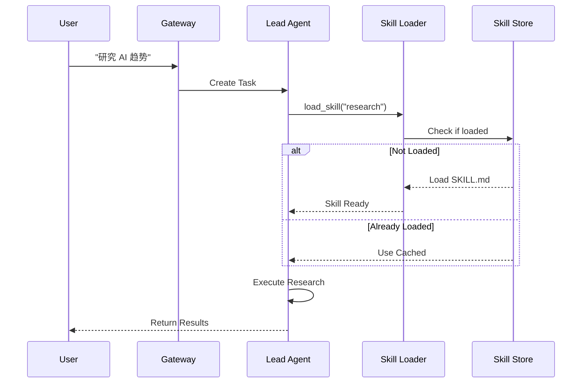

# 天枢计划猎物 #010 - 架构图

**猎物**: DeerFlow + RuFlo  
**日期**: 2026-03-26  
**格式**: Mermaid + ASCII

---

## 🦌 DeerFlow 架构

### 系统概览



```mermaid
flowchart TB
    subgraph User["👤 User Layer"]
        Web[Web UI]
        CLI[CLI]
        IM[IM Channels<br/>Telegram/Slack/Feishu]
    end

    subgraph Gateway["🚪 Gateway API Layer"]
        Thread[Thread Management]
        Skill[Skill Loading]
        File[File Upload]
    end

    subgraph Agent["🤖 LangGraph Agent Server"]
        Lead[Lead Agent]
        Sub[Sub-Agent Pool]
    end

    subgraph Resources["📦 Resources"]
        Skills[Skills<br/>Progressive Loading]
        Tools[Tools<br/>Web/Bash/MCP]
        Memory[Memory<br/>Persistent]
    end

    subgraph Sandbox["🔒 Sandbox Execution"]
        Docker[Docker Container]
        K8s[Kubernetes Pod]
        FS[Isolated Filesystem]
    end

    User --> Gateway
    Gateway --> Agent
    Lead --> Sub
    Agent --> Resources
    Resources --> Sandbox
    Sandbox --> Docker & K8s & FS

    style User fill:#1a1a2e,stroke:#0f3460
    style Gateway fill:#16213e,stroke:#0f3460
    style Agent fill:#1a1a2e,stroke:#e94560
    style Resources fill:#16213e,stroke:#e94560
    style Sandbox fill:#1a1a2e,stroke:#0f3460
```

### 技能加载流程



### Sub-Agent 分解

```mermaid
flowchart TB
    Lead[Lead Agent] --> Decompose[Task Decomposition]
    
    Decompose --> Sub1[Sub-Agent 1<br/>Research]
    Decompose --> Sub2[Sub-Agent 2<br/>Analysis]
    Decompose --> Sub3[Sub-Agent 3<br/>Synthesis]
    
    Sub1 --> Exec1[Execute in Sandbox]
    Sub2 --> Exec2[Execute in Sandbox]
    Sub3 --> Exec3[Execute in Sandbox]
    
    Exec1 --> Report1[Result 1]
    Exec2 --> Report2[Result 2]
    Exec3 --> Report3[Result 3]
    
    Report1 --> Synthesize[Lead Synthesizes]
    Report2 --> Synthesize
    Report3 --> Synthesize
    
    Synthesize --> Final[Final Output]

    style Lead fill:#e94560,stroke:#1a1a2e
    style Sub1 fill:#0f3460,stroke:#16213e
    style Sub2 fill:#0f3460,stroke:#16213e
    style Sub3 fill:#0f3460,stroke:#16213e
```



### Sandbox 隔离

```
┌─────────────────────────────────────────────────────────┐
│                    Host Machine                          │
│                                                          │
│  ┌────────────────────────────────────────────────────┐ │
│  │           Docker Container (Task 1)                 │ │
│  │  ┌──────────────────────────────────────────────┐  │ │
│  │  │  /mnt/user-data/                              │  │ │
│  │  │  ├── uploads/    ← Task 1 Files              │  │ │
│  │  │  ├── workspace/  ← Task 1 Work               │  │ │
│  │  │  └── outputs/    ← Task 1 Results            │  │ │
│  │  │                                              │  │ │
│  │  │  Skills: /mnt/skills/public/                 │  │ │
│  │  │  Tools: web_search, bash, file_ops           │  │ │
│  │  └──────────────────────────────────────────────┘  │ │
│  └────────────────────────────────────────────────────┘ │
│                                                          │
│  ┌────────────────────────────────────────────────────┐ │
│  │           Docker Container (Task 2)                 │ │
│  │  [Isolated from Task 1]                            │ │
│  └────────────────────────────────────────────────────┘ │
│                                                          │
└─────────────────────────────────────────────────────────┘
```

---

## 🌊 RuFlo 架构

### 系统概览



```mermaid
flowchart TB
    subgraph User["👤 User Layer"]
        CC[Claude Code]
        CLI[CLI Commands]
    end

    subgraph Entry["🚪 Entry Layer"]
        AID[AIDefence Security<br/>Injection/PII/Jailbreak]
    end

    subgraph Routing["🧭 Routing Layer"]
        QL[Q-Learning Router]
        MoE[MoE - 8 Experts]
        SK[Skills - 42+]
        HK[Hooks - 17]
    end

    subgraph Swarm["🐝 Swarm Coordination"]
        Topo[Topologies<br/>mesh/hier/ring/star]
        Cons[Consensus<br/>Raft/BFT/Gossip]
        Clm[Claims<br/>Human-Agent Coord]
    end

    subgraph Agents["🤖 60+ Agents"]
        AG1[coder]
        AG2[tester]
        AG3[reviewer]
        AG4[architect]
        AG5[security]
    end

    subgraph Intelligence["🧠 RuVector Intelligence"]
        SONA[SONA<br/><0.05ms]
        EWC[EWC++<br/>No Forgetting]
        HNSW[HNSW<br/>150x faster]
        Graph[Knowledge Graph]
    end

    subgraph Resources["📦 Resources"]
        Mem[(Memory<br/>AgentDB)]
        Prov[Providers<br/>6 LLM]
        Work[Workers - 12]
    end

    User --> Entry
    Entry --> Routing
    Routing --> Swarm
    Swarm --> Agents
    Agents --> Intelligence
    Intelligence --> Resources

    style Intelligence fill:#1a1a2e,stroke:#e94560,stroke-width:2px
    style Routing fill:#16213e,stroke:#0f3460
    style Swarm fill:#1a1a2e,stroke:#0f3460
```

### 自学习循环

```mermaid
flowchart LR
    Task[Task Input] --> Route[Route Decision]
    Route --> Execute[Agent Execution]
    Execute --> Result[Result Output]
    
    Result --> Store[Store Pattern]
    Store --> HNSW[(HNSW Index)]
    
    HNSW --> Learn[SONA Learning]
    Learn --> Update[Update Router]
    
    Update -.->|Next Task| Route
    
    style Learn fill:#e94560,stroke:#1a1a2e
    style HNSW fill:#0f3460,stroke:#16213e
```



### 3-Tier 成本优化

```
┌─────────────────────────────────────────────────────────┐
│                    Task Input                            │
└─────────────────────────────────────────────────────────┘
                            ↓
┌─────────────────────────────────────────────────────────┐
│              Intelligent Router (0.57ms)                 │
│         Analyzes: complexity, domain, urgency           │
└─────────────────────────────────────────────────────────┘
                            ↓
        ┌───────────────────┼───────────────────┐
        ↓                   ↓                   ↓
┌───────────────┐  ┌───────────────┐  ┌───────────────┐
│    Tier 1     │  │    Tier 2     │  │    Tier 3     │
│ Agent Booster │  │  Haiku/Sonnet │  │     Opus      │
│    (WASM)     │  │   (Fast LLM)  │  │  (Smart LLM)  │
│               │  │               │  │               │
│ Latency:      │  │ Latency:      │  │ Latency:      │
│   <1ms        │  │   500ms-2s    │  │   2-5s        │
│               │  │               │  │               │
│ Cost:         │  │ Cost:         │  │ Cost:         │
│   $0          │  │   $0.0002-    │  │   $0.015      │
│               │  │   $0.003      │  │               │
│               │  │               │  │               │
│ Use Cases:    │  │ Use Cases:    │  │ Use Cases:    │
│ - var→const   │  │ - Bug fixes   │  │ - Architecture│
│ - add-types   │  │ - Refactoring │  │ - Security    │
│ - add-logging │  │ - Features    │  │ - Distributed │
│ - remove-     │  │               │  │   Systems     │
│   console     │  │               │  │               │
│               │  │               │  │               │
│ Speedup:      │  │               │  │               │
│ 352x vs LLM   │  │               │  │               │
└───────────────┘  └───────────────┘  └───────────────┘
                            ↓
┌─────────────────────────────────────────────────────────┐
│                    Task Output                           │
│         Total Savings: 75% API Cost Reduction           │
└─────────────────────────────────────────────────────────┘
```

### Swarm 拓扑

```mermaid
flowchart TB
    subgraph Hierarchical["👑 Hierarchical (Default)"]
        Q1[Queen] --> W1[Worker 1]
        Q1 --> W2[Worker 2]
        Q1 --> W3[Worker 3]
        Q1 --> W4[Worker 4]
    end

    subgraph Mesh["🕸️ Mesh"]
        M1[Agent] <--> M2[Agent]
        M2 <--> M3[Agent]
        M3 <--> M4[Agent]
        M4 <--> M1
    end

    subgraph Ring["💍 Ring"]
        R1[Agent] --> R2[Agent]
        R2 --> R3[Agent]
        R3 --> R4[Agent]
        R4 --> R1
    end

    subgraph Star["⭐ Star"]
        S1[Hub] --> S2[Agent]
        S1 --> S3[Agent]
        S1 --> S4[Agent]
        S1 --> S5[Agent]
    end

    style Hierarchical fill:#1a1a2e,stroke:#e94560
    style Mesh fill:#16213e,stroke:#0f3460
    style Ring fill:#1a1a2e,stroke:#0f3460
    style Star fill:#16213e,stroke:#e94560
```



### Memory 架构

```mermaid
flowchart LR
    subgraph Input["📥 Input"]
        Query[Query/Pattern]
        Insight[New Insight]
    end

    subgraph Processing["⚙️ Processing"]
        Embed[ONNX Embeddings]
        Normalize[Normalization]
        Learn[LearningBridge<br/>SONA + ReasoningBank]
    end

    subgraph Storage["💾 Storage"]
        HNSW[(HNSW Index<br/>150x faster)]
        SQLite[(SQLite Cache)]
        AgentDB[(AgentDB)]
        Graph[MemoryGraph<br/>PageRank]
    end

    subgraph Retrieval["🔍 Retrieval"]
        Vector[Vector Search]
        Semantic[Semantic Match]
        Rank[Graph-Aware Ranking]
        Results[Top-K Results]
    end

    Input --> Processing
    Processing --> Storage
    Storage --> Retrieval

    style Storage fill:#1a1a2e,stroke:#e94560
    style Processing fill:#16213e,stroke:#0f3460
```



---

## 🔍 对比架构

### 执行模型

```
DeerFlow:                          RuFlo:
┌──────────────┐                  ┌──────────────┐
│   User UI    │                  │ Claude Code  │
└──────┬───────┘                  └──────┬───────┘
       ↓                                  ↓
┌──────────────┐                  ┌──────────────┐
│   Gateway    │                  │  MCP Server  │
└──────┬───────┘                  └──────┬───────┘
       ↓                                  ↓
┌──────────────┐                  ┌──────────────┐
│ Lead Agent   │                  │ Q-Learning   │
└──────┬───────┘                  │    Router    │
       ↓                          └──────┬───────┘
┌──────────────┐                                ↓
│ Sub-Agents   │                  ┌──────────────┐
└──────┬───────┘                  │   Swarm      │
       ↓                          │ Coordination │
┌──────────────┐                  └──────┬───────┘
│   Sandbox    │                                ↓
│ (Docker/K8s) │                  ┌──────────────┐
└──────┬───────┘                  │  60+ Agents  │
       ↓                          └──────┬───────┘
┌──────────────┐                                ↓
│   Output     │                  ┌──────────────┐
└──────────────┘                  │   RuVector   │
                                  │ Intelligence │
                                  └──────┬───────┘
                                           ↓
                                  ┌──────────────┐
                                  │   Output     │
                                  └──────────────┘
```

### 技能系统对比

```
DeerFlow:                          RuFlo:
┌──────────────┐                  ┌──────────────┐
│ SKILL.md     │                  │ MCP Tools    │
│ (Markdown)   │                  │ (259 tools)  │
└──────┬───────┘                  └──────┬───────┘
       ↓                                  ↓
┌──────────────┐                  ┌──────────────┐
│ Progressive  │                  │ Hooks System │
│ Loading      │                  │ (17 hooks)   │
└──────┬───────┘                  └──────┬───────┘
       ↓                                  ↓
┌──────────────┐                  ┌──────────────┐
│ .skill       │                  │ Plugin SDK   │
│ Archives     │                  │ (NPM/IPFS)   │
└──────────────┘                  └──────────────┘
```

---

## 📊 性能指标

```
DeerFlow:
├─ Context Engineering: 支持长时任务不爆 context
├─ Sandbox Isolation: 完整 Docker/K8s 隔离
├─ Skill Loading: 按需加载 (Token 优化)
└─ Multi-Channel: Telegram/Slack/Feishu

RuFlo:
├─ Routing Latency: 0.57ms (100% 准确率)
├─ HNSW Search: ~61µs (150x-12,500x 加速)
├─ Agent Booster: <1ms (352x vs LLM, $0 成本)
├─ SONA Adaptation: <0.05ms
├─ Token Optimization: 30-50% 减少
├─ API Cost: -75% (智能路由)
└─ PostgreSQL QPS: 16,400 (RuVector)
```

---

## 🎯 Aether-Sync 整合架构

```mermaid
flowchart TB
    subgraph User["👤 User Layer"]
        CC[Claude Code]
        CLI[CLI]
        Web[Web UI]
    end

    subgraph Core["🎯 Aether-Sync Core"]
        Router[Intelligent Router]
        Skills[Skill Manager<br/>ClawHub]
        Obs[Observability]
    end

    subgraph DeerFlow["🦌 DeerFlow Integration"]
        DFS[DF Sandbox]
        DFL[DF Skill Loader]
        DFM[DF Multi-Channel]
    end

    subgraph RuFlo["🌊 RuFlo Integration"]
        RFM[RuFlo Memory<br/>HNSW]
        RFS[RuFlo Swarm]
        RFO[RuFlo Optimizer<br/>WASM]
    end

    subgraph Unified["🧠 Unified Intelligence"]
        Model[Model Router<br/>Cost/Quality]
        Learn[Learning Engine<br/>SONA-style]
        Mem[Unified Memory<br/>Vector + Graph]
    end

    User --> Core
    Core --> DeerFlow
    Core --> RuFlo
    DeerFlow --> Unified
    RuFlo --> Unified

    style Core fill:#1a1a2e,stroke:#e94560,stroke-width:2px
    style Unified fill:#16213e,stroke:#0f3460,stroke-width:2px
```



---

**图表完成时间**: 2026-03-26 08:30 CST  
**格式**: Mermaid (GitHub/Notion 兼容) + ASCII
