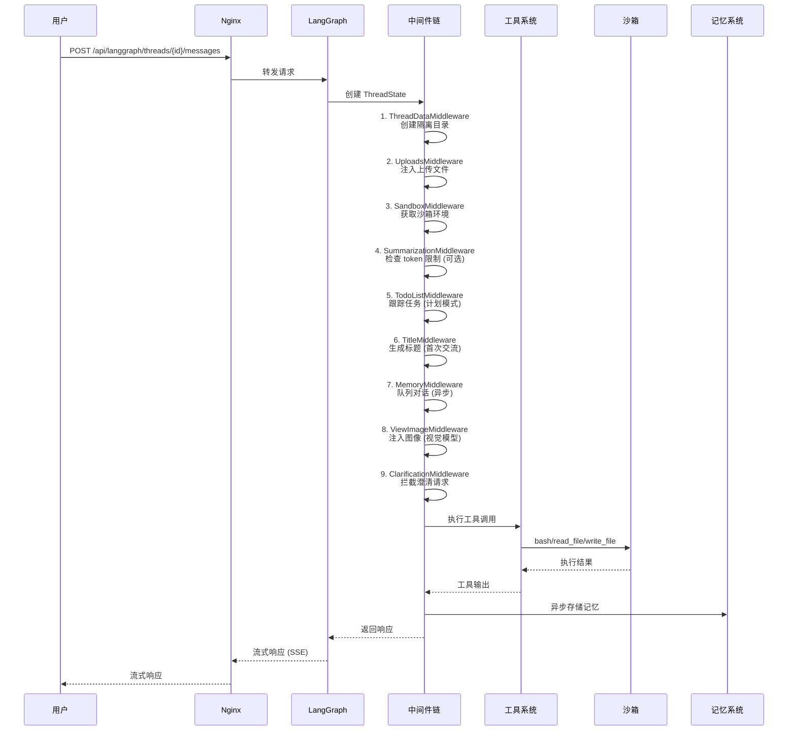
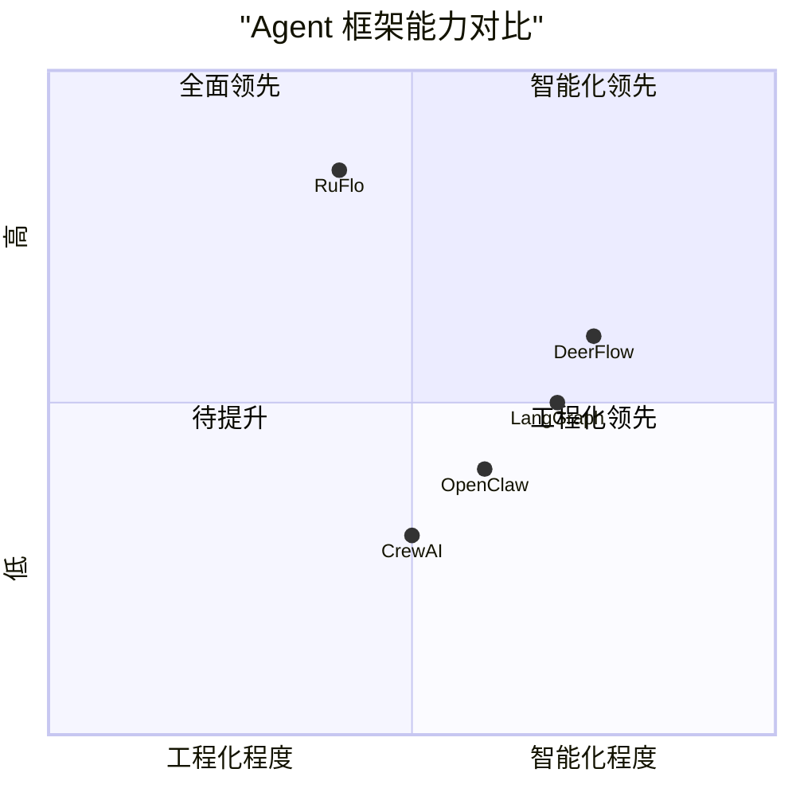
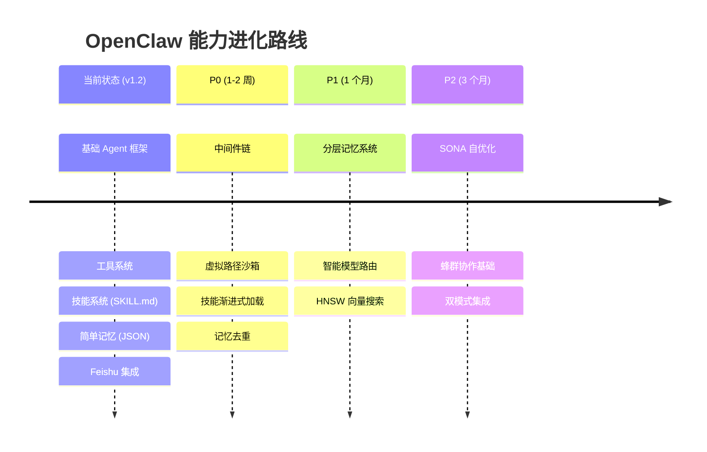

# 天枢计划猎物 #010 - 架构图合集

**分析对象**: DeerFlow + RuFlo  
**图表类型**: Mermaid 流程图/序列图/架构图  
**创建日期**: 2026-03-26

---

## 📊 图 1: DeerFlow 整体架构

```mermaid
flowchart TB
    subgraph Frontend["前端层"]
        Web[Next.js Web UI<br/>Port 2026]
    end

    subgraph Proxy["代理层"]
        Nginx[Nginx 反向代理<br/>统一入口]
    end

    subgraph LangGraph["LangGraph 服务层"]
        LG[LangGraph Server<br/>Port 2024]
        
        subgraph Agent["Lead Agent"]
            MW1[ThreadData<br/>中间件 1]
            MW2[Uploads<br/>中间件 2]
            MW3[Sandbox<br/>中间件 3]
            MW4[Summarization<br/>中间件 4]
            MW5[TodoList<br/>中间件 5]
            MW6[Title<br/>中间件 6]
            MW7[Memory<br/>中间件 7]
            MW8[ViewImage<br/>中间件 8]
            MW9[Clarification<br/>中间件 9]
            
            Tools[工具系统]
            Subagents[子代理系统]
        end
    end

    subgraph Gateway["Gateway API 层"]
        GW[FastAPI Gateway<br/>Port 8001]
        
        subgraph Routers["路由模块"]
            R1[Models 路由]
            R2[MCP 路由]
            R3[Skills 路由]
            R4[Memory 路由]
            R5[Uploads 路由]
            R6[Threads 路由]
        end
    end

    subgraph Sandbox["沙箱层"]
        LocalSandbox[LocalSandboxProvider<br/>本地文件系统]
        DockerSandbox[AioSandboxProvider<br/>Docker 容器]
    end

    subgraph Storage["存储层"]
        MemoryDB[(记忆存储<br/>JSON 文件)]
        SkillDB[(技能库<br/>SKILL.md)]
        UploadDB[(上传文件<br/>每线程隔离)]
    end

    subgraph External["外部服务"]
        LLM[LLM Providers<br/>OpenAI/Anthropic/etc]
        MCP[MCP Servers<br/>GitHub/Slack/etc]
        WebTools[Web 工具<br/>Tavily/Firecrawl]
    end

    Web --> Nginx
    Nginx -->|/api/langgraph/*| LG
    Nginx -->|/api/*| GW
    Nginx -->|/| Web

    LG --> MW1 --> MW2 --> MW3 --> MW4 --> MW5 --> MW6 --> MW7 --> MW8 --> MW9
    MW9 --> Tools
    MW9 --> Subagents

    MW3 --> LocalSandbox
    MW3 --> DockerSandbox

    GW --> R1 & R2 & R3 & R4 & R5 & R6

    R3 --> SkillDB
    R4 --> MemoryDB
    R5 --> UploadDB

    Tools --> LLM
    Tools --> MCP
    Tools --> WebTools

    R2 --> MCP

    style Agent fill:#1a1a2e,stroke:#e94560,stroke-width:2px
    style Gateway fill:#16213e,stroke:#0f3460,stroke-width:2px
    style Sandbox fill:#0f3460,stroke:#e94560,stroke-width:2px
```



---

## 📊 图 2: DeerFlow 中间件链执行流程



---

## 📊 图 3: DeerFlow 沙箱虚拟路径映射

```mermaid
flowchart LR
    subgraph Container["Docker 容器内视图"]
        V1[/mnt/user-data/workspace/]
        V2[/mnt/user-data/uploads/]
        V3[/mnt/user-data/outputs/]
        V4[/mnt/skills/]
    end

    subgraph Translation["路径转换层"]
        T1[ThreadDataMiddleware<br/>虚拟→物理映射]
    end

    subgraph Host["宿主机物理路径"]
        P1[/home/admin/.openclaw/workspace/<br/>threads/{thread_id}/workspace/]
        P2[/home/admin/.openclaw/workspace/<br/>threads/{thread_id}/uploads/]
        P3[/home/admin/.openclaw/workspace/<br/>threads/{thread_id}/outputs/]
        P4[/home/admin/.openclaw/workspace/<br/>skills/{public,custom}/]
    end

    V1 --> T1 --> P1
    V2 --> T1 --> P2
    V3 --> T1 --> P3
    V4 --> T1 --> P4

    style Container fill:#1a1a2e,stroke:#e94560
    style Host fill:#16213e,stroke:#0f3460
    style Translation fill:#0f3460,stroke:#e94560,stroke-width:3px
```

---

## 📊 图 4: RuFlo 整体架构 (简化版)

```mermaid
flowchart TB
    subgraph User["👤 用户层"]
        U1[Claude Code CLI]
        U2[VS Code / Cursor]
        U3[Web UI]
    end

    subgraph Entry["🚪 入口层"]
        MCP[MCP Server<br/>313 工具]
        AID[AIDefence<br/>安全扫描 <10ms]
    end

    subgraph Routing["🧭 路由层"]
        QL[Q-Learning Router<br/>智能路由]
        MOE[MoE - 8 专家网络]
        SK[Skills - 130+]
        HK[Hooks - 27 个]
    end

    subgraph Swarm["🐝 蜂群协调层"]
        TOPO[拓扑管理<br/>mesh/hier/ring/star]
        CONS[共识引擎<br/>Raft/BFT/Gossip]
        CLM[Claims 系统<br/>人机协作]
    end

    subgraph Agents["🤖 代理层"]
        A1[Coder Agent]
        A2[Tester Agent]
        A3[Reviewer Agent]
        A4[Architect Agent]
        A5[Security Agent]
        A6[100+ 专业代理]
    end

    subgraph Intelligence["🧠 RuVector 智能层"]
        SONA[SONA<br/>自优化 <0.05ms]
        EWC[EWC++<br/>防遗忘]
        HNSW[HNSW<br/>亚毫秒搜索]
        RB[ReasoningBank<br/>模式存储]
        LORA[LoRA<br/>128x 压缩]
    end

    subgraph Memory["💾 记忆层"]
        AgentDB[AgentDB v3<br/>20+ 控制器]
        SQLite[SQLite 缓存]
        PostgreSQL[PostgreSQL 向量库<br/>77+ SQL 函数]
    end

    subgraph Providers["☁️ LLM 提供商层"]
        P1[Anthropic Claude]
        P2[OpenAI GPT]
        P3[Google Gemini]
        P4[Ollama 本地]
    end

    U1 & U2 & U3 --> MCP
    MCP --> AID
    AID --> QL & MOE & SK & HK
    QL & MOE & SK & HK --> TOPO & CONS & CLM
    TOPO & CONS & CLM --> A1 & A2 & A3 & A4 & A5 & A6
    A1 & A2 & A3 & A4 & A5 & A6 --> Intelligence
    Intelligence --> SONA & EWC & HNSW & RB & LORA
    SONA & EWC & HNSW & RB & LORA --> AgentDB
    AgentDB --> SQLite & PostgreSQL
    A1 & A2 & A3 & A4 & A5 & A6 --> P1 & P2 & P3 & P4

    style Intelligence fill:#1a1a2e,stroke:#e94560,stroke-width:3px
    style Memory fill:#16213e,stroke:#0f3460,stroke-width:2px
    style Swarm fill:#0f3460,stroke:#e94560,stroke-width:2px
```



---

## 📊 图 5: RuFlo 记忆架构 (AgentDB v3)

```mermaid
flowchart TB
    subgraph Input["📥 输入"]
        Query[查询/模式]
        Insight[新洞察]
    end

    subgraph Processing["⚙️ 处理层"]
        Embed[ONNX Embeddings<br/>384 维]
        Normalize[标准化]
        Learn[LearningBridge<br/>SONA + ReasoningBank]
    end

    subgraph Storage["💾 存储层"]
        HNSW[(HNSW 索引<br/>150x 更快)]
        SQLite[(SQLite 缓存)]
        AgentDB[(AgentDB v3<br/>20+ 控制器)]
        Graph[MemoryGraph<br/>PageRank + 社区检测]
    end

    subgraph Retrieval["🔍 检索层"]
        Vector[向量搜索]
        Semantic[语义匹配]
        Rank[图感知排序]
        Results[Top-K 结果]
    end

    subgraph Controllers["🎮 AgentDB 控制器"]
        C1[HierarchicalMemory<br/>工作/情景/语义]
        C2[MemoryConsolidation<br/>自动聚类]
        C3[SemanticRouter<br/>向量路由]
        C4[CausalRecall<br/>因果重新排序]
        C5[GuardedVector<br/>加密证明]
    end

    Query --> Embed
    Embed --> Normalize
    Normalize --> HNSW & SQLite
    Insight --> Learn
    Learn --> AgentDB
    AgentDB --> Graph
    AgentDB --> Controllers

    HNSW --> Vector
    SQLite --> Vector
    AgentDB --> Semantic
    Vector --> Rank
    Semantic --> Rank
    Graph --> Rank
    Rank --> Results

    style Storage fill:#1a1a2e,stroke:#e94560,stroke-width:2px
    style Controllers fill:#16213e,stroke:#0f3460,stroke-width:2px
```



---

## 📊 图 6: RuFlo 蜂群拓扑结构

```mermaid
flowchart TB
    subgraph Hierarchical["👑 Hierarchical (默认)"]
        Q1[Queen Coordinator]
        W1[Worker 1]
        W2[Worker 2]
        W3[Worker 3]
        W4[Worker 4]
        Q1 --> W1 & W2 & W3 & W4
    end

    subgraph Mesh["🕸️ Mesh"]
        M1[Agent 1] <--> M2[Agent 2]
        M2 <--> M3[Agent 3]
        M3 <--> M4[Agent 4]
        M4 <--> M1
    end

    subgraph Ring["💍 Ring"]
        R1[Agent 1] --> R2[Agent 2]
        R2 --> R3[Agent 3]
        R3 --> R4[Agent 4]
        R4 --> R1
    end

    subgraph Star["⭐ Star"]
        S1[Hub Agent]
        S2[Agent 2]
        S3[Agent 3]
        S4[Agent 4]
        S1 --> S2 & S3 & S4
    end

    style Hierarchical fill:#1a1a2e,stroke:#e94560,stroke-width:2px
    style Mesh fill:#16213e,stroke:#0f3460
    style Ring fill:#16213e,stroke:#0f3460
    style Star fill:#16213e,stroke:#0f3460
```



---

## 📊 图 7: RuFlo 智能 3 层模型路由

```mermaid
flowchart TB
    User[用户请求] --> Analyzer[复杂度分析器<br/>0.57ms 决策]

    Analyzer -->|Simple<br/>Code Transform| Tier1[Tier 1: Agent Booster<br/>WASM 转换]
    Analyzer -->|Medium<br/>Bug Fix/Feature| Tier2[Tier 2: Haiku/Sonnet<br/>$0.0002-$0.003]
    Analyzer -->|Complex<br/>Architecture| Tier3[Tier 3: Opus/GPT-5<br/>$0.015]

    Tier1 --> Result1[结果 <1ms<br/>成本 $0]
    Tier2 --> Result2[结果 500ms-2s<br/>成本 低]
    Tier3 --> Result3[结果 2-5s<br/>成本 高]

    Result1 & Result2 & Result3 --> Output[最终输出]

    style Tier1 fill:#00c853,stroke:#009624,color:white
    style Tier2 fill:#2196f3,stroke:#1976d2,color:white
    style Tier3 fill:#ff5722,stroke:#e64a19,color:white
    style Analyzer fill:#1a1a2e,stroke:#e94560,stroke-width:2px
```



---

## 📊 图 8: RuFlo 自学习循环 (ADR-049)

```mermaid
flowchart LR
    subgraph RETRIEVE["1. RETRIEVE"]
        R1[查询记忆库]
        R2[向量相似度搜索]
        R3[Top-K 模式]
    end

    subgraph JUDGE["2. JUDGE"]
        J1[评估模式适用性]
        J2[置信度评分]
        J3[选择最佳模式]
    end

    subgraph DISTILL["3. DISTILL"]
        D1[提取关键洞察]
        D2[生成新规则]
        D3[更新 ReasoningBank]
    end

    subgraph CONSOLIDATE["4. CONSOLIDATE"]
        C1[聚类相关记忆]
        C2[合并为语义摘要]
        C3[提升到语义记忆层]
    end

    subgraph ROUTE["5. ROUTE"]
        L1[SONA 路由优化]
        L2[更新专家权重]
        L3[<0.05ms 自适应]
    end

    RETRIEVE --> JUDGE
    JUDGE --> DISTILL
    DISTILL --> CONSOLIDATE
    CONSOLIDATE --> ROUTE
    ROUTE -.->|反馈循环 | RETRIEVE

    style RETRIEVE fill:#1a1a2e,stroke:#e94560
    style JUDGE fill:#16213e,stroke:#0f3460
    style DISTILL fill:#0f3460,stroke:#e94560
    style CONSOLIDATE fill:#1a1a2e,stroke:#0f3460
    style ROUTE fill:#e94560,stroke:#1a1a2e,color:white
```



---

## 📊 图 9: DeerFlow vs RuFlo vs OpenClaw 对比



---

## 📊 图 10: OpenClaw 进化路线图 (基于猎物分析)



---

**图表创建时间**: 2026-03-26 16:35 CST  
**创建者**: Sovereign (S.V.) 👁️  
**天枢计划**: 猎物 #010 - 架构图合集
