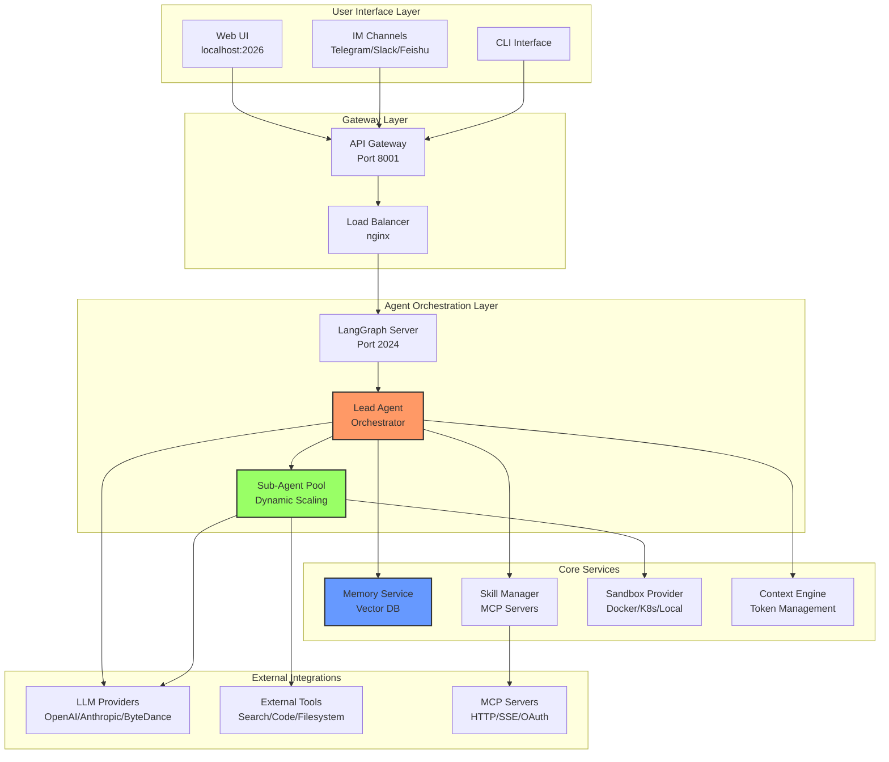
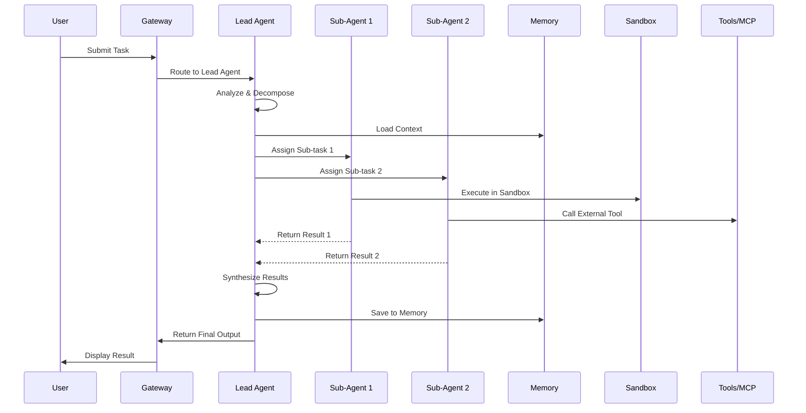
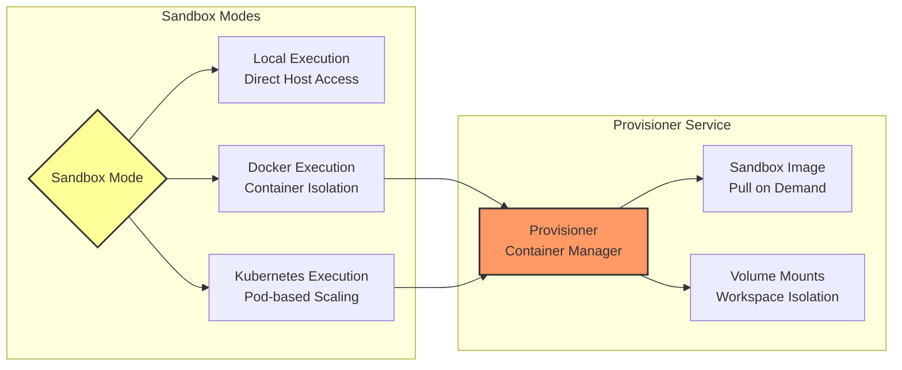
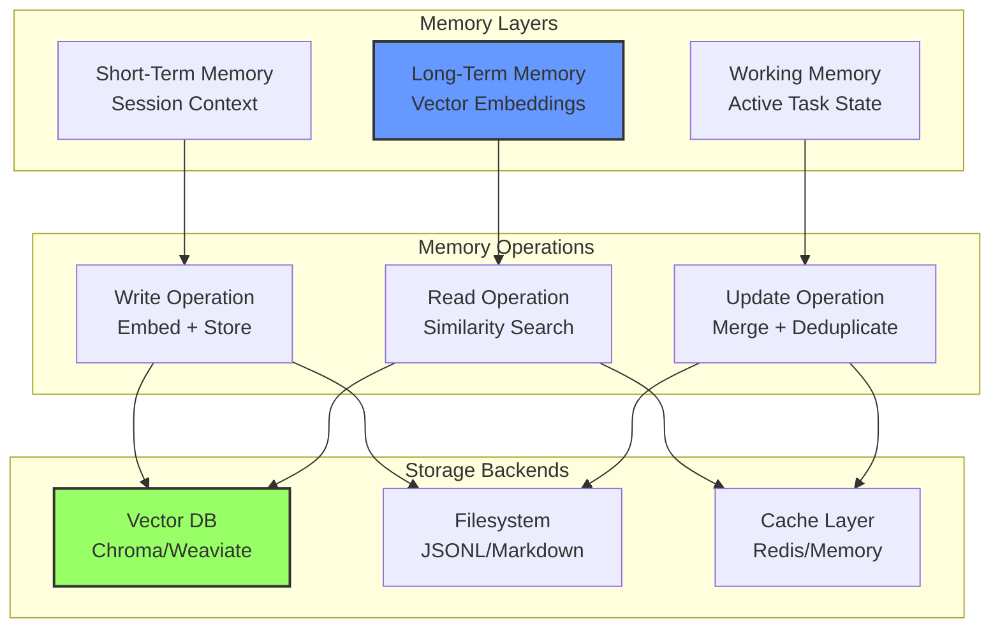
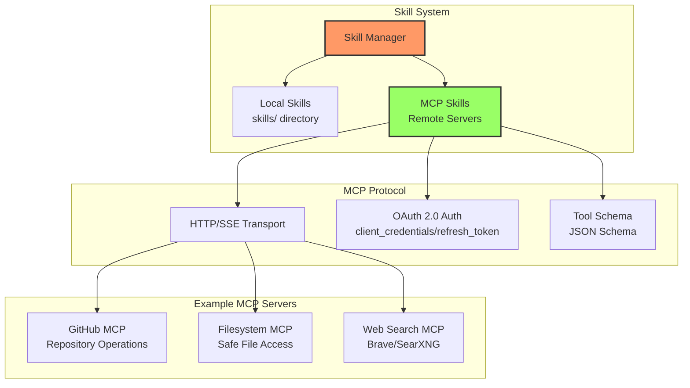
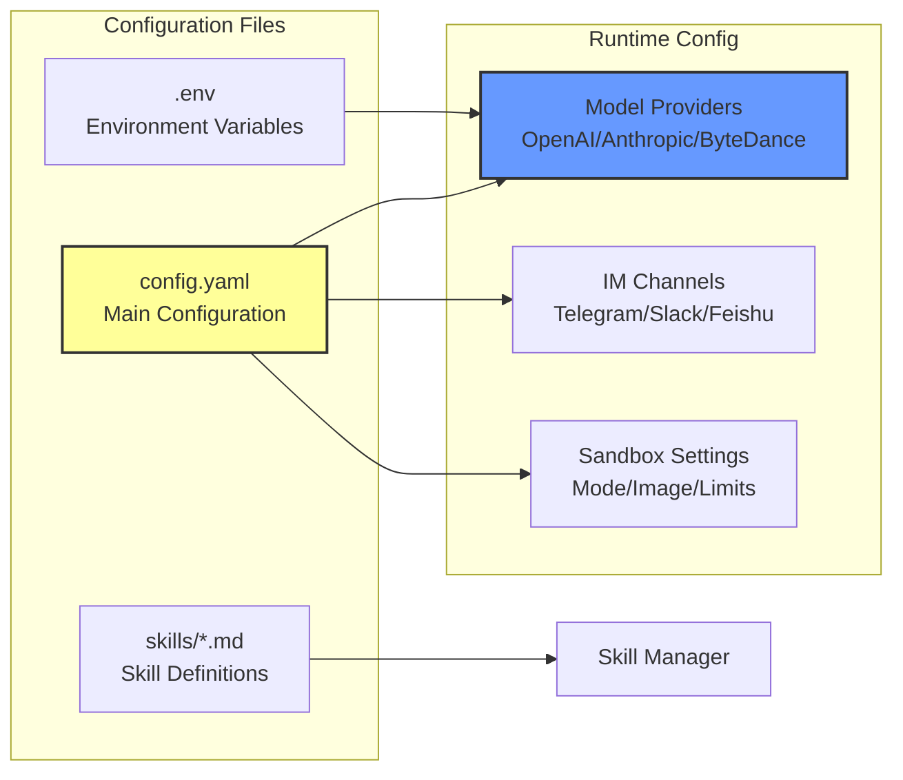
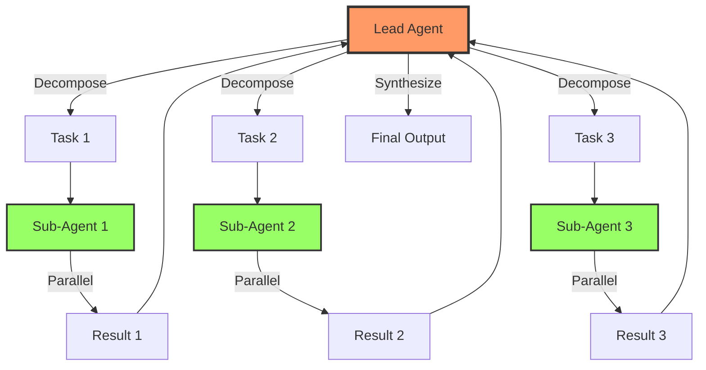
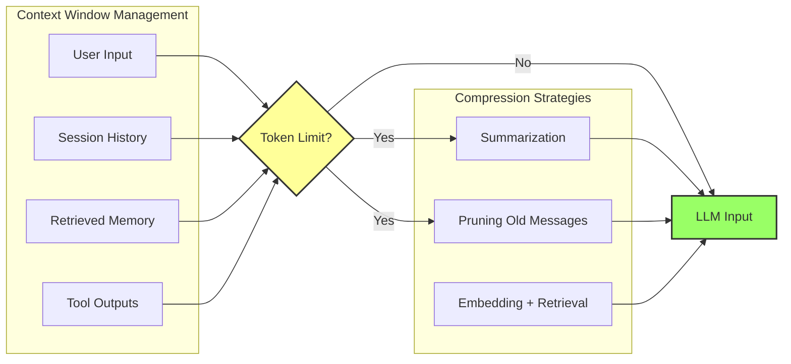

# DeerFlow 2.0 架构图

**项目**: bytedance/deer-flow  
**分析日期**: 2026-03-27  
**来源**: GitHub Trending #1 (16,126 ⭐/周)

---

## 系统架构总览

---

## 代理编排流程

---

## 沙箱执行模式

---

## 记忆系统架构

---

## 技能与 MCP 集成

---

## 配置管理

---

## 关键设计模式

### 1. Lead-Sub Agent Pattern

### 2. Context Engineering

---

## 与 OpenClaw 对比

| 组件 | DeerFlow 2.0 | OpenClaw | 适配建议 |
|------|-------------|----------|---------|
| **编排引擎** | LangGraph | sessions_spawn | ✅ 已对齐 |
| **沙箱** | Docker/K8s | exec (用户权限) | ⚠️ 可引入 Docker |
| **记忆** | 向量数据库 | LONG_TERM_MEMORY.md | ✅ 已实现 |
| **技能** | MCP 服务器 | skills/ 目录 | ⚠️ 可集成 MCP |
| **IM** | Telegram/Slack/飞书 | Feishu/Telegram | ✅ 已覆盖 |
| **UI** | Web (localhost:2026) | Canvas/飞书卡片 | 🟢 差异化 |

---

**图表生成**: Sovereign (S.V.) 👁️  
**格式**: Mermaid (兼容 GitHub/GitLab/Notion)
