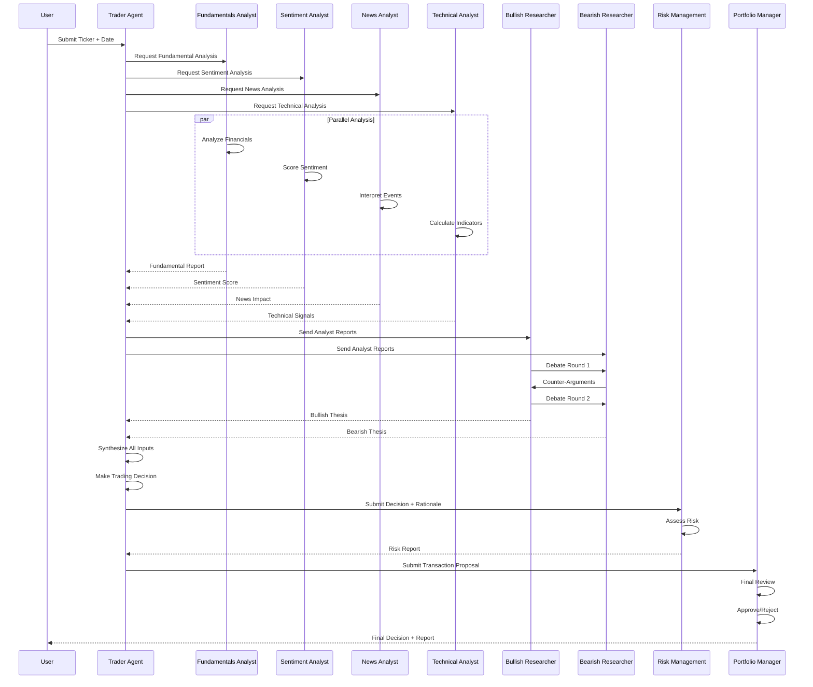
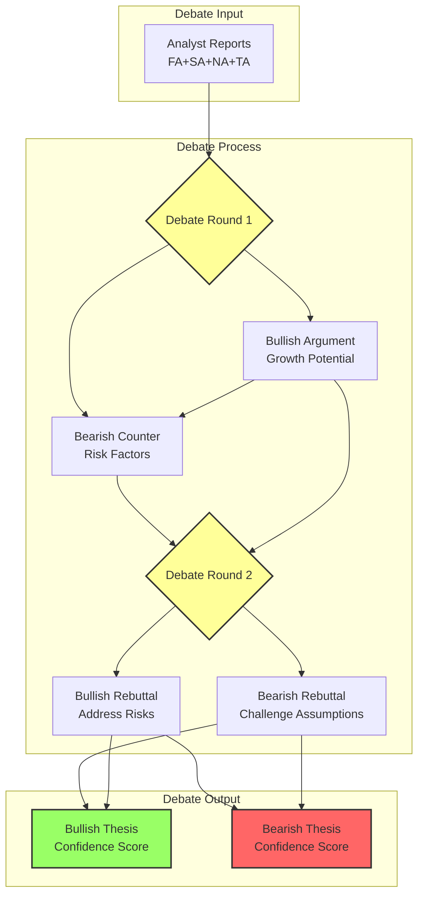
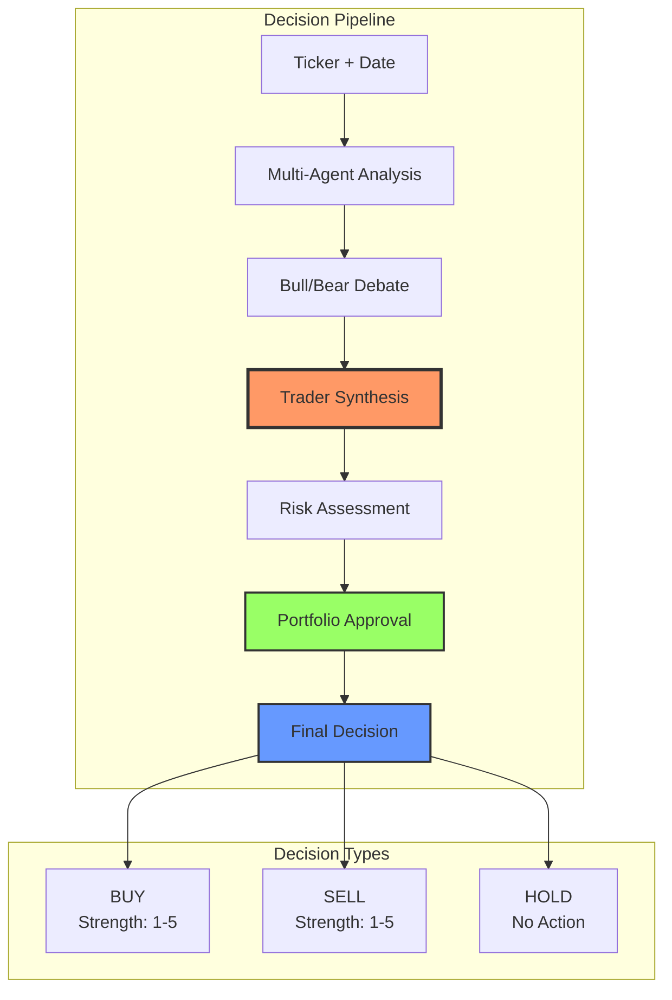
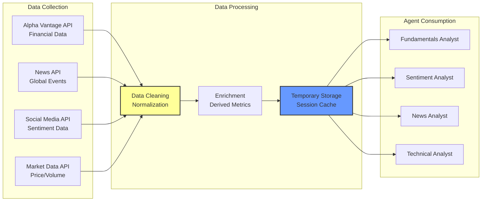
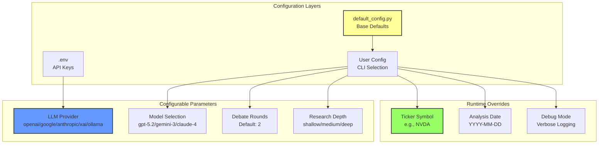
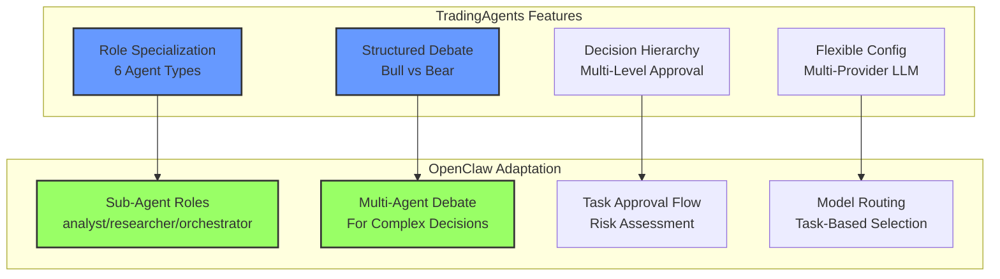

# TradingAgents 架构图

**项目**: TauricResearch/TradingAgents  
**分析日期**: 2026-03-27  
**来源**: GitHub Trending #2 (9,209 ⭐/周)

---

## 系统架构总览

```mermaid
graph TB
    subgraph "User Interface"
        CLI[Interactive CLI<br/>ticker/date/LLM selection]
        PY[Python API<br/>TradingAgentsGraph]
    end

    subgraph "Agent Teams"
        subgraph "Analyst Team"
            FA[Fundamentals Analyst<br/>Company Financials]
            SA[Sentiment Analyst<br/>Social Media Sentiment]
            NA[News Analyst<br/>Global News/Macro]
            TA[Technical Analyst<br/>Indicators/Patterns]
        end

        subgraph "Researcher Team"
            BR[Bullish Researcher<br/>Pro-Growth Arguments]
            BER[Bearish Researcher<br/>Risk Identification]
        end

        subgraph "Decision Layer"
            TR[Trader Agent<br/>Trading Decision]
            RM[Risk Management<br/>Risk Assessment]
            PM[Portfolio Manager<br/>Final Approval]
        end
    end

    subgraph "Data Sources"
        FIN[Financial Data<br/>Alpha Vantage]
        SOC[Social Media<br/>Twitter/Reddit]
        NEWS[News API<br/>Global News]
        MKT[Market Data<br/>Price/Volume]
    end

    subgraph "LLM Providers"
        GPT[OpenAI<br/>GPT-5.x]
        GEM[Google<br/>Gemini 3.x]
        CL[Anthropic<br/>Claude 4.x]
        GRO[xAI<br/>Grok 4.x]
        OLL[Ollama<br/>Local Models]
    end

    CLI --> TR
    PY --> TR
    FA --> BR
    SA --> BR
    NA --> BR
    TA --> BR
    FA --> BER
    SA --> BER
    NA --> BER
    TA --> BER
    BR --> TR
    BER --> TR
    TR --> RM
    RM --> PM
    PM --> EXCH[Simulated Exchange]
    
    FIN --> FA
    SOC --> SA
    NEWS --> NA
    MKT --> TA
    
    GPT -.-> FA
    GPT -.-> SA
    GPT -.-> NA
    GPT -.-> TA
    GPT -.-> BR
    GPT -.-> BER
    GPT -.-> TR
    GPT -.-> RM
    GPT -.-> PM

    style TR fill:#f96,stroke:#333,stroke-width:3px
    style PM fill:#9f6,stroke:#333,stroke-width:2px
    style BR fill:#69f,stroke:#333,stroke-width:2px
    style BER fill:#f66,stroke:#333,stroke-width:2px
```



---

## 代理角色详细流程



---

## 辩论机制详解



---

## 决策流程



---

## 数据流架构



---

## 配置系统



---

## LangGraph 实现

```mermaid
graph TB
    subgraph "Graph Nodes"
        start[Start Node<br/>Initialize State]
        analysts[Analyst Node<br/>Parallel Execution]
        researchers[Researcher Node<br/>Debate Loop]
        trader[Trader Node<br/>Decision Making]
        risk[Risk Node<br/>Assessment]
        portfolio[Portfolio Node<br/>Final Approval]
        end[End Node<br/>Return Result]
    end

    subgraph "State Management"
        state[Graph State<br/>TypedDict]
        messages[Message History]
        reports[Analyst Reports]
        decision[Trading Decision]
    end

    start --> analysts
    analysts --> researchers
    researchers --> trader
    trader --> risk
    risk --> portfolio
    portfolio --> end

    analysts -.-> state
    researchers -.-> state
    trader -.-> state
    risk -.-> state
    portfolio -.-> state

    state --> messages
    state --> reports
    state --> decision

    style start fill:#9f6,stroke:#333,stroke-width:2px
    style end fill:#9f6,stroke:#333,stroke-width:2px
    style trader fill:#f96,stroke:#333,stroke-width:3px
    style state fill:#69f,stroke:#333,stroke-width:2px
```

---

## 与 OpenClaw 适配点

### 可直接借鉴的设计



### 实现优先级

| 功能 | 优先级 | 复杂度 | 预期收益 |
|------|--------|--------|---------|
| 子代理角色元数据 | P0 | 低 | 高 |
| 多代理辩论机制 | P0 | 中 | 高 |
| 任务审批流程 | P1 | 中 | 中 |
| 模型路由策略 | P1 | 低 | 中 |
| 风险评估模块 | P2 | 高 | 中 |

---

## 关键设计模式总结

### 1. 专业化分工模式
```
Analyst Team (信息收集) → Researcher Team (批判性评估) → 
Trader (决策) → Risk Management (风险评估) → 
Portfolio Manager (最终批准)
```

### 2. 结构化辩论模式
```
Bullish Arguments ↔ Bearish Counter-Arguments
    ↓ (Round 1)
Bullish Rebuttal ↔ Bearish Rebuttal
    ↓ (Round 2)
Synthesized Thesis with Confidence Scores
```

### 3. 分层决策模式
```
Level 1: Analyst Reports (事实收集)
Level 2: Researcher Debate (观点碰撞)
Level 3: Trader Decision (初步决策)
Level 4: Risk Assessment (风险控制)
Level 5: Portfolio Approval (最终批准)
```

---

**图表生成**: Sovereign (S.V.) 👁️  
**格式**: Mermaid (兼容 GitHub/GitLab/Notion)  
**应用建议**: 在 OpenClaw 复杂任务中引入辩论机制和分层决策
