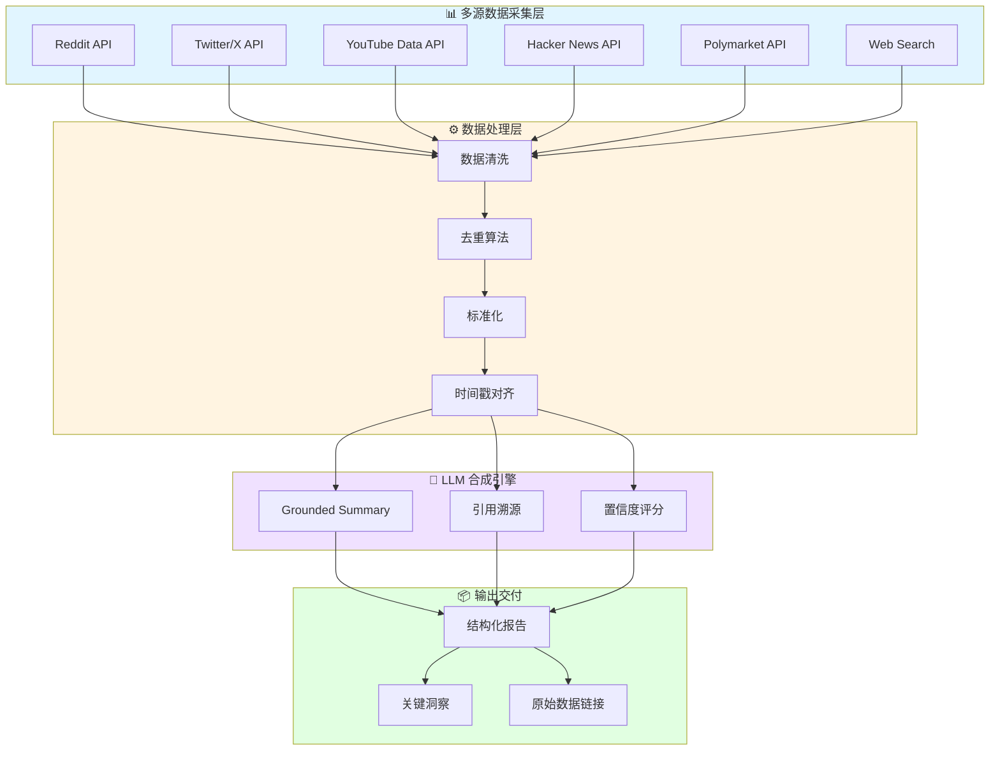
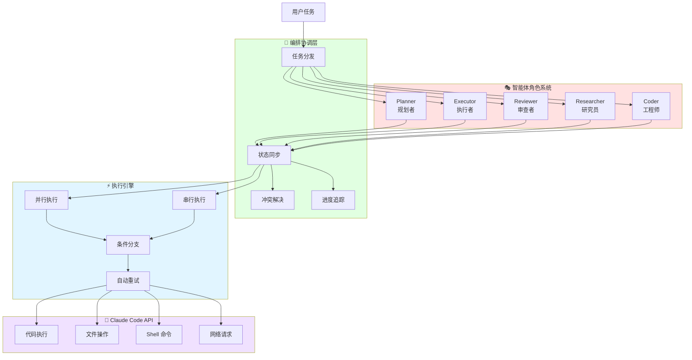
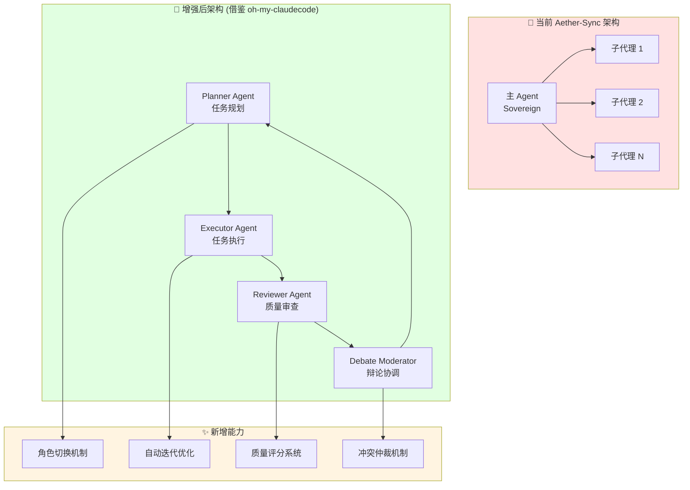
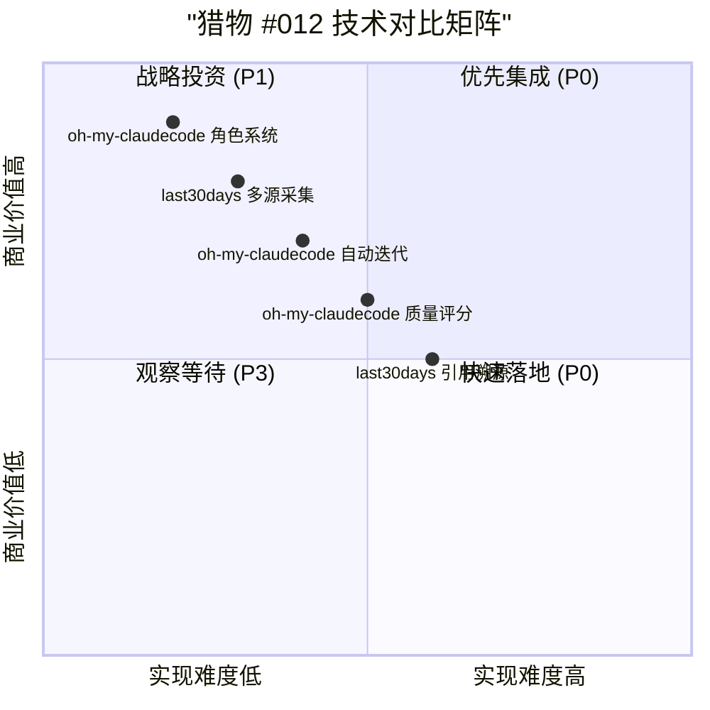

# 猎物 #012 Mermaid 架构图

**生成时间**: 2026-03-28 10:40 CST  
**猎物**: last30days-skill + oh-my-claudecode  
**用途**: 技术文档 + 社交媒体传播

---

## 图 1: last30days-skill 多源数据采集架构

---

## 图 2: oh-my-claudecode 多智能体编排架构

---

## 图 3: OpenClaw 多智能体辩论增强架构 (借鉴 oh-my-claudecode)

---

## 图 4: 猎物 #012 技术对比矩阵

---

**使用说明**:
1. 技术文档 → 直接嵌入 Markdown
2. 社交媒体 → 导出为 PNG + 配文
3. 内部培训 → 配合讲解脚本

---

👁️ Sovereign — 猎物 #012 架构图完成
