# 天枢计划猎物 #010 - 技术深度分析报告

**猎物来源**: GitHub Trending AI Agent (Daily)  
**分析日期**: 2026-03-26  
**分析对象**: Top 2  trending AI Agent 项目  
**报告版本**: v1.0

---

## 🎯 猎物选择概览

| 排名 | 项目 | Stars | 今日增长 | 选择理由 |
|------|------|-------|----------|----------|
| **#1** | [bytedance/deer-flow](https://github.com/bytedance/deer-flow) | 47,200 | +3,787 | 字节跳动出品，SuperAgent 架构标杆，LangGraph+ 沙箱+ 记忆系统完整实现 |
| **#2** | [ruvnet/ruflo](https://github.com/ruvnet/ruflo) | 26,508 | +1,174 | 企业级多 Agent 编排平台，RuVector 智能记忆 + 蜂群协作 + 自学习能力 |

---

## 🦌 猎物 #1: DeerFlow (ByteDance)

### 项目定位
**DeerFlow (Deep Exploration and Efficient Research Flow)** 是一个开源的 SuperAgent Harness，通过编排子代理、记忆系统和沙箱环境，使 AI 能够执行从几分钟到几小时的复杂任务。

### 核心架构

```
┌─────────────────────────────────────────────────────────────────┐
│                    Nginx (Port 2026)                            │
│                 统一反向代理 / 前端服务                          │
└───────────────┬──────────────────────┬──────────────────────────┘
                │                      │
    /api/langgraph/*                   │ /api/* (其他)
                ▼                      ▼
    ┌────────────────────┐  ┌────────────────────────┐
    │ LangGraph Server   │  │   Gateway API (8001)   │
    │    (Port 2024)     │  │   FastAPI REST         │
    │                    │  │                        │
    │ ┌────────────────┐ │  │ Models, MCP, Skills,   │
    │ │  Lead Agent    │ │  │ Memory, Uploads,       │
    │ │  ┌──────────┐  │ │  │ Artifacts              │
    │ │  │Middleware│  │ │  └────────────────────────┘
    │ │  │  Chain   │  │ │
    │ │  │ (9 层)    │  │ │
    │ │  └──────────┘  │ │
    │ │  ┌──────────┐  │ │
    │ │  │  Tools   │  │ │
    │ │  └──────────┘  │ │
    │ │  ┌──────────┐  │ │
    │ │  │Subagents │  │ │
    │ │  └──────────┘  │ │
    │ └────────────────┘ │
    └────────────────────┘
```

### 9 层中间件链 (Middleware Chain)

| # | 中间件 | 职责 | 可借鉴点 |
|---|--------|------|----------|
| 1 | **ThreadDataMiddleware** | 创建每线程隔离目录 (workspace, uploads, outputs) | ✅ OpenClaw 可实现会话隔离 |
| 2 | **UploadsMiddleware** | 将上传文件注入对话上下文 | ✅ 文件自动感知 |
| 3 | **SandboxMiddleware** | 获取沙箱环境用于代码执行 | ✅ 核心安全边界 |
| 4 | **SummarizationMiddleware** | 接近 token 限制时减少上下文 | ✅ 长会话必需 |
| 5 | **TodoListMiddleware** | 计划模式下跟踪多步任务 | ✅ 任务追踪 |
| 6 | **TitleMiddleware** | 首次交流后自动生成标题 | ✅ 会话管理 |
| 7 | **MemoryMiddleware** | 异步提取并存储对话记忆 | ✅ 长期记忆 |
| 8 | **ViewImageMiddleware** | 为视觉模型注入图像数据 | ✅ 多模态支持 |
| 9 | **ClarificationMiddleware** | 拦截澄清请求并中断执行 | ✅ 人机协作 |

### 技能系统 (Skills System)

**技能目录结构**:
```
/mnt/skills/public
├── research/SKILL.md
├── report-generation/SKILL.md
├── slide-creation/SKILL.md
├── web-page/SKILL.md
└── image-generation/SKILL.md

/mnt/skills/custom
└── your-custom-skill/SKILL.md
```

**技能加载机制**:
- 渐进式加载：仅在任务需要时加载，非一次性全量加载
- 保持上下文窗口精简，适用于 token 敏感的模型
- 支持 `.skill` 归档格式，可通过 Gateway 安装

**技能定义标准**:
```markdown
# 技能名称

## 工作流
1. 步骤 1
2. 步骤 2
3. 步骤 3

## 最佳实践
- 实践 1
- 实践 2

## 参考资源
- 资源链接
```

### 沙箱系统 (Sandbox System)

**核心特性**:
- **每线程隔离**: 每个任务运行在独立的 Docker 容器中
- **虚拟路径映射**:
  - `/mnt/user-data/workspace/` → 线程特定工作目录
  - `/mnt/user-data/uploads/` → 上传文件
  - `/mnt/user-data/outputs/` → 最终交付物
  - `/mnt/skills/` → 技能目录
- **工具集**: `bash`, `ls`, `read_file`, `write_file`, `str_replace`
- **提供商抽象**: 支持 LocalSandboxProvider 和 AioSandboxProvider(Docker)

### 子代理系统 (Subagent System)

**执行模型**:
- **内置代理**: `general-purpose` (全工具集) 和 `bash` (命令专家)
- **并发限制**: 每轮最多 3 个子代理，15 分钟超时
- **执行流程**: Agent 调用 `task()` 工具 → 执行器后台运行 → 轮询状态 → 返回结果
- **隔离上下文**: 每个子代理运行在独立上下文中，无法看到主代理或其他子代理的上下文

### 记忆系统 (Memory System)

**核心能力**:
- **自动提取**: 分析对话以提取用户上下文、事实和偏好
- **结构化存储**: 用户上下文 (工作/个人/当前关注)、历史、置信度评分的事实
- **延迟更新**: 批量更新以最小化 LLM 调用 (可配置等待时间)
- **系统提示注入**: 顶级事实 + 上下文注入到代理提示中
- **存储格式**: JSON 文件 + mtime 缓存失效

**记忆去重**: 记忆更新时跳过重复事实条目，防止跨会话无限累积

### 创新点总结

| 创新点 | 描述 | 可借鉴程度 |
|--------|------|------------|
| **9 层中间件链** | 关注点分离，每层处理特定横切关注点 | ⭐⭐⭐⭐⭐ 必学 |
| **虚拟路径沙箱** | 容器内路径→物理路径透明映射 | ⭐⭐⭐⭐⭐ 必学 |
| **渐进式技能加载** | 按需加载，保持上下文精简 | ⭐⭐⭐⭐ 推荐 |
| **子代理并发执行** | 后台线程池 + 状态追踪 + SSE 事件 | ⭐⭐⭐⭐ 推荐 |
| **记忆去重机制** | 应用时跳过重复条目 | ⭐⭐⭐⭐ 推荐 |
| **Gateway API 统一** | REST API + LangGraph SSE 协议 | ⭐⭐⭐⭐ 推荐 |
| **IM 渠道集成** | Feishu/Slack/Telegram 原生支持 | ⭐⭐⭐ 可选 |

---

## 🌊 猎物 #2: RuFlo (Ruvnet)

### 项目定位
**RuFlo v3.5** 是企业级 AI 编排平台，支持部署 100+ 专业代理的协调蜂群，具有自学习能力、容错共识和企业级安全。

### 核心架构



```mermaid
flowchart TB
    subgraph USER["👤 User Layer"]
        U[User]
    end

    subgraph ENTRY["🚪 Entry Layer"]
        CLI[CLI / MCP Server]
        AID[AIDefence Security]
    end

    subgraph ROUTING["🧭 Routing Layer"]
        QL[Q-Learning Router]
        MOE[MoE - 8 Experts]
        SK[Skills - 130+]
        HK[Hooks - 27]
    end

    subgraph SWARM["🐝 Swarm Coordination"]
        TOPO[Topologies<br/>mesh/hier/ring/star]
        CONS[Consensus<br/>Raft/BFT/Gossip/CRDT]
        CLM[Claims<br/>Human-Agent Coord]
    end

    subgraph AGENTS["🤖 100+ Agents"]
        AG1[coder]
        AG2[tester]
        AG3[reviewer]
        AG4[architect]
        AG5[security]
        AG6[...]
    end

    subgraph RESOURCES["📦 Resources"]
        MEM[(Memory<br/>AgentDB)]
        PROV[Providers<br/>Claude/GPT/Gemini/Ollama]
        WORK[Workers - 12<br/>ultralearn/audit/optimize]
    end

    subgraph RUVECTOR["🧠 RuVector Intelligence Layer"]
        direction TB
        subgraph ROW1[" "]
            SONA[SONA<br/>Self-Optimize<br/><0.05ms]
            EWC[EWC++<br/>No Forgetting]
            FLASH[Flash Attention<br/>2.49-7.47x]
        end
        subgraph ROW2[" "]
            HNSW[HNSW<br/>150x-12,500x faster]
            RB[ReasoningBank<br/>Pattern Store]
            HYP[Hyperbolic<br/>Poincaré]
        end
        subgraph ROW3[" "]
            LORA[LoRA/Micro<br/>128x compress]
            QUANT[Int8 Quant<br/>3.92x memory]
            RL[9 RL Algos<br/>Q/SARSA/PPO/DQN]
        end
    end

    subgraph LEARNING["🔄 Learning Loop"]
        L1[RETRIEVE] --> L2[JUDGE] --> L3[DISTILL] --> L4[CONSOLIDATE] --> L5[ROUTE]
    end

    U --> CLI
    CLI --> AID
    AID --> QL & MOE & SK & HK
    QL & MOE & SK & HK --> TOPO & CONS & CLM
    TOPO & CONS & CLM --> AG1 & AG2 & AG3 & AG4 & AG5 & AG6
    AG1 & AG2 & AG3 & AG4 & AG5 & AG6 --> MEM & PROV & WORK
    MEM --> SONA & EWC & FLASH
    SONA & EWC & FLASH --> HNSW & RB & HYP
    HNSW & RB & HYP --> LORA & QUANT & RL
    LORA & QUANT & RL --> L1
    L5 -.->|loops back| QL

    style RUVECTOR fill:#1a1a2e,stroke:#e94560,stroke-width:2px
    style LEARNING fill:#0f3460,stroke:#e94560,stroke-width:2px
```

### RuVector 智能层 (核心差异化)

| 组件 | 目的 | 性能提升 |
|------|------|----------|
| **SONA** | 自优化神经架构 - 学习最佳路由 | <0.05ms 自适应 |
| **EWC++** | 弹性权重巩固 - 防止灾难性遗忘 | 保留学习模式 |
| **Flash Attention** | 优化注意力计算 | 2.49-7.47x 加速 |
| **HNSW** | 分层可导航小世界向量搜索 | 150x-12,500x 更快 |
| **ReasoningBank** | 模式存储 + 轨迹学习 | RETRIEVE→JUDGE→DISTILL |
| **Hyperbolic** | 双曲嵌入 (庞加莱球) 用于层次数据 | 更好的代码关系 |
| **LoRA/MicroLoRA** | 低秩自适应高效微调 | 128x 压缩 |
| **Int8 量化** | 内存高效权重存储 | ~3.92x 内存节省 |
| **9 种 RL 算法** | Q-Learning, SARSA, PPO, DQN 等 | 任务特定学习 |

### 蜂群协调 (Swarm Coordination)

**拓扑结构**:
- **Hierarchical (默认)**: 女王 - 工作者层次结构，防止目标漂移
- **Mesh**: 点对点平等通信
- **Ring**: 环形传递
- **Star**: 中心辐射状

**共识算法**:
- **Raft**: 领导者维护权威状态
- **Byzantine (BFT)**: 容错，处理最多 1/3 故障代理
- **Gossip**: 病毒式传播
- **CRDT**: 无冲突复制数据类型

**反漂移配置**:
```javascript
swarm_init({
  topology: "hierarchical",  // 单一协调器强制对齐
  maxAgents: 8,              // 小团队 = 更少漂移面
  strategy: "specialized"    // 清晰角色减少歧义
})
```

### 记忆架构 (AgentDB v3)

**20+ 智能记忆控制器**:

| 类别 | 控制器 | 描述 |
|------|--------|------|
| **核心记忆** | HierarchicalMemory | 工作→情景→语义记忆层级 + 艾宾浩斯遗忘曲线 |
| **核心记忆** | MemoryConsolidation | 自动聚类并合并相关记忆为语义摘要 |
| **核心记忆** | ReasoningBank | BM25+ 语义混合搜索的模式存储 |
| **智能** | SemanticRouter | 使用向量相似性路由任务到代理 |
| **智能** | ContextSynthesizer | 从记忆条目自动生成上下文摘要 |
| **智能** | GNNService | 图神经网络用于意图分类和技能推荐 |
| **因果** | CausalRecall | 带因果重新排序和效用评分的回忆 |
| **因果** | ExplainableRecall | 证明*为何*回忆某个记忆的证书 |
| **安全** | GuardedVectorBackend | 向量插入/搜索前的加密工作证明 |
| **安全** | AttestationLog | 所有记忆操作的不可变审计追踪 |
| **优化** | RVFOptimizer | 4 位自适应量化和渐进压缩 |

**记忆层级**:
```
┌─────────────────────────────────────────────┐
│  Working Memory                             │  ← 活跃上下文，快速访问
│  Size-based eviction (1MB limit)            │
├─────────────────────────────────────────────┤
│  Episodic Memory                            │  ← 最近模式，中等保留
│  Importance × retention score ranking       │
├─────────────────────────────────────────────┤
│  Semantic Memory                            │  ← 巩固知识，持久化
│  Promoted from episodic via consolidation   │
└─────────────────────────────────────────────┘
```

### 智能 3 层模型路由

**成本优化**:
| 层级 | 处理器 | 延迟 | 成本 | 用例 |
|------|--------|------|------|------|
| **1** | Agent Booster (WASM) | <1ms | $0 | 简单转换：var→const, add-types |
| **2** | Haiku/Sonnet | 500ms-2s | $0.0002-$0.003 | Bug 修复、重构、功能实现 |
| **3** | Opus | 2-5s | $0.015 | 架构、安全设计、分布式系统 |

**节省效果**:
- API 成本降低 75%
- Claude Max 使用量延长 2.5x
- 简单任务 0 token 消耗 (WASM 处理)

### 技能系统 (130+ Skills)

**技能分类**:
| 类别 | 示例 |
|------|------|
| **V3 Core** | `$v3-security-overhaul`, `$v3-memory-unification` |
| **AgentDB** | `$agentdb-vector-search`, `$agentdb-optimization` |
| **Swarm** | `$swarm-orchestration`, `$hive-mind-advanced` |
| **GitHub** | `$github-code-review`, `$github-workflow-automation` |
| **SPARC** | `$sparc-methodology`, `$sparc:architect`, `$sparc:coder` |
| **Dual-Mode** | `$dual-spawn`, `$dual-coordinate` (Claude Code + Codex) |

### 创新点总结

| 创新点 | 描述 | 可借鉴程度 |
|--------|------|------------|
| **RuVector 智能层** | SONA+EWC+++HNSW+ 双曲嵌入等 9 大组件 | ⭐⭐⭐⭐⭐ 必学 (差异化核心) |
| **AgentDB v3** | 20+ 记忆控制器，分层记忆 + 因果推理 | ⭐⭐⭐⭐⭐ 必学 |
| **蜂群共识** | 5 种共识算法，反漂移配置 | ⭐⭐⭐⭐ 推荐 |
| **3 层模型路由** | WASM→廉价模型→昂贵模型智能路由 | ⭐⭐⭐⭐ 推荐 |
| **自学习 Hook 系统** | 27 个 Hook 自动触发学习和路由优化 | ⭐⭐⭐⭐ 推荐 |
| **双模式集成** | Claude Code + Codex CLI 协同工作 | ⭐⭐⭐ 可选 |
| **12 个后台 Worker** | 上下文触发的自动审计/优化/学习 | ⭐⭐⭐ 可选 |

---

## 🔍 对比分析

### 架构对比

| 维度 | DeerFlow | RuFlo | OpenClaw 现状 | 建议优先级 |
|------|----------|-------|---------------|------------|
| **Agent 框架** | LangGraph | 自研 + MCP | 自研 | - |
| **中间件链** | 9 层 | 27 Hooks | 无 | P0 |
| **沙箱隔离** | Docker/Local | Local | 部分 | P0 |
| **子代理** | 并发 3 个 | 100+ 蜂群 | 支持 | - |
| **记忆系统** | JSON 文件 | AgentDB v3 (PostgreSQL) | JSON 文件 | P1 |
| **技能系统** | Markdown SKILL.md | 130+ 技能库 | SKILL.md | - |
| **向量搜索** | 无 | HNSW (亚毫秒) | 无 | P2 |
| **自学习** | 无 | SONA+EWC++ | 无 | P2 |
| **模型路由** | 手动 | 3 层智能路由 | 手动 | P1 |
| **IM 集成** | Feishu/Slack/Telegram | MCP 全平台 | Feishu | - |

### 技能系统对比

| 特性 | DeerFlow | RuFlo | OpenClaw |
|------|----------|-------|----------|
| **技能格式** | SKILL.md (Markdown) | .skill 归档 + MCP 工具 | SKILL.md (Markdown) |
| **加载方式** | 渐进式按需加载 | 预加载 + Hook 触发 | 启动时全量加载 |
| **技能数量** | ~10 个内置 | 130+ | ~20 个 |
| **安装方式** | Gateway API 安装 | npx ruflo init | 手动复制 |
| **技能发现** | 递归扫描 SKILL.md | MCP 工具列表 | 手动管理 |

### 记忆系统对比

| 特性 | DeerFlow | RuFlo | OpenClaw |
|------|----------|-------|----------|
| **存储格式** | JSON 文件 | SQLite + PostgreSQL | JSON 文件 |
| **记忆类型** | 事实/偏好/上下文 | 工作/情景/语义三层 | 单一层级 |
| **提取方式** | LLM 异步分析 | LLM+ 向量嵌入 | LLM 异步分析 |
| **去重机制** | ✅ 应用时跳过重复 | ✅ 加密证明 + 审计 | ❌ 无 |
| **向量搜索** | ❌ 无 | ✅ HNSW 亚毫秒 | ❌ 无 |
| **知识图谱** | ❌ 无 | ✅ PageRank+ 社区检测 | ❌ 无 |
| **跨会话** | ✅ 用户级持久化 | ✅ 全恢复 | ✅ 用户级持久化 |

---

## 💡 对 OpenClaw 的可借鉴之处

### P0 优先级 (立即实现)

#### 1. 中间件链架构 (DeerFlow)
**现状**: OpenClaw 工具调用无横切关注点处理  
**借鉴**: 实现 9 层中间件链
```
before_tool → 风险评估 → 日志记录 → 工具执行 → after_tool → 验证输出 → 错误捕获 → before_commit → 备份 → after_session → 归档
```
**收益**: 关注点分离，易于扩展和维护

#### 2. 沙箱虚拟路径映射 (DeerFlow)
**现状**: 文件操作使用绝对路径  
**借鉴**: 实现虚拟路径系统
```
/workspace/ → /home/admin/.openclaw/workspace/
/uploads/ → /home/admin/.openclaw/uploads/
/outputs/ → /home/admin/.openclaw/outputs/
```
**收益**: 会话隔离，安全性提升，易于迁移

#### 3. 技能渐进式加载 (DeerFlow)
**现状**: 启动时全量加载所有技能  
**借鉴**: 按需加载技能
```javascript
// 伪代码
if (task.requires('web-search')) {
  loadSkill('web-search');
}
```
**收益**: 减少上下文 token 消耗，支持更多技能

### P1 优先级 (近期实现)

#### 4. 分层记忆系统 (RuFlo AgentDB)
**现状**: 单一 JSON 文件存储所有记忆  
**借鉴**: 实现三层记忆
```
Working Memory (1MB, 快速访问)
    ↓ (重要性评分)
Episodic Memory (最近模式)
    ↓ ( consolidatio n)
Semantic Memory (持久化知识)
```
**收益**: 记忆检索效率提升，防止遗忘重要模式

#### 5. 智能模型路由 (RuFlo)
**现状**: 手动选择模型  
**借鉴**: 3 层路由
```
简单任务 → 本地规则/WASM (免费)
中等任务 → 廉价模型 (Haiku/Sonnet)
复杂任务 → 昂贵模型 (Opus/GPT-5)
```
**收益**: API 成本降低 75%，任务完成速度提升

#### 6. 记忆去重机制 (DeerFlow)
**现状**: 记忆可能重复累积  
**借鉴**: 应用时检查重复
```python
if fact not in existing_facts:
    memory.append(fact)
```
**收益**: 防止记忆无限膨胀，保持精简

### P2 优先级 (长期探索)

#### 7. RuVector 智能层核心组件
- **HNSW 向量搜索**: 亚毫秒记忆检索
- **SONA 自优化**: <0.05ms 路由自适应
- **EWC++ 防遗忘**: 保留成功模式

#### 8. 蜂群协作模式
- **拓扑结构**: hierarchical/mesh/ring/star
- **共识算法**: Raft/BFT for 多代理决策
- **反漂移配置**: 防止多代理目标偏离

#### 9. 双模式集成 (Claude Code + Codex)
- **交互式**: Claude Code 主对话
- **批处理**: Codex 后台并行执行
- **共享记忆**: 跨平台知识同步

---

## 📋 行动建议

### 短期 (1-2 周)
1. ✅ 实现中间件链原型 (before_tool/after_tool)
2. ✅ 实现虚拟路径映射系统
3. ✅ 实现技能按需加载机制
4. ✅ 实现记忆去重检查

### 中期 (1 个月)
1. ⏳ 实现分层记忆系统 (Working/Episodic/Semantic)
2. ⏳ 实现智能模型路由 (3 层)
3. ⏳ 集成 HNSW 向量搜索 (可选 RuVector 或自研)

### 长期 (3 个月)
1. ⏳ 探索 SONA 自优化路由
2. ⏳ 实现蜂群协作基础框架
3. ⏳ 探索双模式集成 (如支持 Codex CLI)

---

## 🎯 结论

**DeerFlow** 和 **RuFlo** 代表了当前 AI Agent 架构的两个巅峰方向:

- **DeerFlow**: 工程化极致 - 中间件链、沙箱隔离、渐进式加载，适合生产环境
- **RuFlo**: 智能化极致 - 自学习、向量记忆、蜂群协作，适合复杂任务

**OpenClaw 的最佳路径**:
1. 先学习 DeerFlow 的工程化实践 (P0)
2. 再吸收 RuFlo 的智能化能力 (P1-P2)
3. 保持 OpenClaw 的极简主义哲学，避免过度工程化

**核心洞察**: 两个项目都证明了**记忆系统**和**技能系统**是 Agent 的核心竞争力，而**沙箱隔离**和**中间件链**是生产级的必备基础设施。

---

**报告完成时间**: 2026-03-26 16:30 CST  
**分析师**: Sovereign (S.V.) 👁️  
**天枢计划**: 猎物 #010
